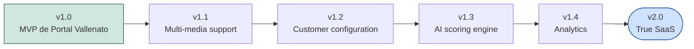

# Roadmap

Este roadmap se organiza por fases incrementales. Cada fase entrega valor
usable por sí sola y se corresponde, en general, con un "Prompt" de
construcción del proyecto. Las fechas no se fijan de antemano: cada fase
comienza cuando la anterior está estable.

## Fase 0 — Foundation ✅ (Prompt 001, este)

Base profesional del proyecto: estructura modular, arquitectura hexagonal,
configuración centralizada, logging, scaffolding de base de datos,
documentación y contratos (`core/ports`) para todos los agentes futuros.
Sin lógica de negocio, sin scrapers, sin conexiones externas.

## Fase 0.1 — Foundation Hardening ✅ (Prompt 001.1)

Revisión arquitectónica antes de comenzar el desarrollo funcional, sin
agregar funcionalidad de negocio: espacio reservado para eventos de
dominio (`core/events/`) y servicios de dominio (`core/services/`),
configuración reforzada de mypy/ruff/pytest/coverage en `pyproject.toml`,
separación de dependencias de producción (`requirements.txt`) y desarrollo
(`requirements-dev.txt`), y una guardarraíl explícita contra módulos
`utils.py` genéricos (ver docs/CODING_STANDARDS.md).

## Fase 1 — Radar & Extractor (en progreso)

- ✅ **Discovery Engine** (Sprint 2, `feature/discovery-engine`): entidades
  de dominio `NewsCandidate`, `Source`, `Article`, `EditorialTask`
  (`core/entities/`); servicio `core.services.discovery_engine.DiscoveryEngine`
  que agrega, deduplica por hash y ordena candidatos de varias fuentes;
  evento `NewsFound` con payload real; `ContentSource` evolucionado para
  devolver `NewsCandidate`; `FakeContentSource` + fixtures JSON para
  probar todo sin red. Ver docs/ARCHITECTURE.md, sección "Discovery
  Engine".
- ⬜ Agente **Radar**: conectar `DiscoveryEngine` con un `ContentSource`
  real (RSS, crawler, ...) y con `Repository` para descartar contra el
  historial editorial persistido (hoy el `DiscoveryEngine` solo deduplica
  dentro de una misma pasada, no contra ejecuciones anteriores).
- ⬜ Agente **Extractor**: extracción estructurada del contenido completo
  (cuerpo, imágenes adicionales) a partir de un `NewsCandidate`, usando
  Playwright/BeautifulSoup/Requests.
- ⬜ Modelos ORM (`database/models/`) para persistir `NewsCandidate` /
  `Article` y sostener la deduplicación entre pasadas.

## Fase 2 — Writer & SEO

- Agente **Writer**: reescritura del artículo con el estilo editorial de
  Portal Vallenato, usando un proveedor de IA a través de
  `core.ports.ai_provider`.
- Agente **SEO**: generación de título SEO, slug, meta descripción y
  etiquetas.
- Primeras plantillas en `prompts/`.

## Fase 3 — Images & WordPress

- Agente **Images**: descarga, procesamiento y organización de imágenes.
- Agente **WordPress**: creación de **borradores** (nunca publicaciones) vía
  WordPress REST API.

## Fase 4 — Telegram & aprobación editorial

- Agente **Telegram**: notificación al equipo editorial con el borrador
  listo para revisión.
- Flujo de aprobación/rechazo editorial registrado en el historial.

## Fase 5 — Social

- Agente **Social**: generación de copys para redes sociales a partir del
  artículo ya aprobado.

## Fase 6 — Scheduler

- Agente **Scheduler**: ejecución programada y periódica de los pipelines
  definidos en `workflows/`.

## Fase 7 — Analytics

- Agente **Analytics**: métricas editoriales (tiempo ahorrado, artículos
  procesados, tasa de aprobación, fuentes más productivas).

## Fase 8 — AI Orchestrator

- Agente **AI Orchestrator**: coordinación inteligente de todos los agentes
  anteriores, con capacidad de decidir dinámicamente el flujo según el tipo
  de contenido detectado.

## Futuro — evolución hacia SaaS

A partir de Sprint 2.2, Portal Vallenato se trata como el **cliente
piloto** de una plataforma pensada para servir a más de un medio digital
independiente — ver [docs/product/PRODUCT_VISION.md](product/PRODUCT_VISION.md).
El MVP (fases 0 a 8 de este documento) no cambia: sigue construyéndose
para un único cliente. Lo que sigue es lo que viene después de v1.0,
detallado en [docs/product/SAAS_EVOLUTION.md](product/SAAS_EVOLUTION.md)
y [docs/product/MVP_SCOPE.md](product/MVP_SCOPE.md).

### v1.1 — Multi-media support

Primer paso hacia multi-tenencia: la plataforma puede desplegarse una
vez por cliente adicional (Etapa "Multi Customer" —
[docs/product/SAAS_EVOLUTION.md](product/SAAS_EVOLUTION.md)), sin
necesidad todavía de que un único despliegue sirva a varios clientes a
la vez.

### v1.2 — Customer configuration

La entidad `MediaOutlet` se vuelve real, y la configuración por cliente
(ver [docs/product/CUSTOMER_CONFIGURATION.md](product/CUSTOMER_CONFIGURATION.md))
empieza a moverse de `.env` a datos.

### v1.3 — AI scoring engine

`DiscoveryEngine` gana una señal de relevancia/calidad sobre cada
`NewsCandidate` (más allá del orden actual por prioridad de fuente y
`confidence` — ver
[docs/architecture/discovery-engine.md](architecture/discovery-engine.md)),
para ayudar a un editor a priorizar qué revisar primero cuando hay
volumen alto.

### v1.4 — Analytics

Métricas por cliente: tiempo ahorrado, tasa de aprobación, fuentes más
productivas — la versión multi-cliente del agente Analytics ya previsto
en la Fase 7.

### v2.0 — True SaaS

Un despliegue compartido sirve a todos los clientes. Incluye lo que hoy
está explícitamente fuera de alcance: autenticación, autorización,
facturación y, probablemente, una API pública — ver
[docs/product/SAAS_EVOLUTION.md](product/SAAS_EVOLUTION.md), etapa
"True SaaS".

## Otros temas técnicos futuros (sin fecha)

- Migración de SQLite a PostgreSQL — se vuelve más urgente, no opcional,
  en cuanto exista más de un cliente concurrente (v1.1 en adelante).
- Panel de control interno (evaluar si amerita introducir una
  API/FastAPI) — ver v1.2 y v2.0.
