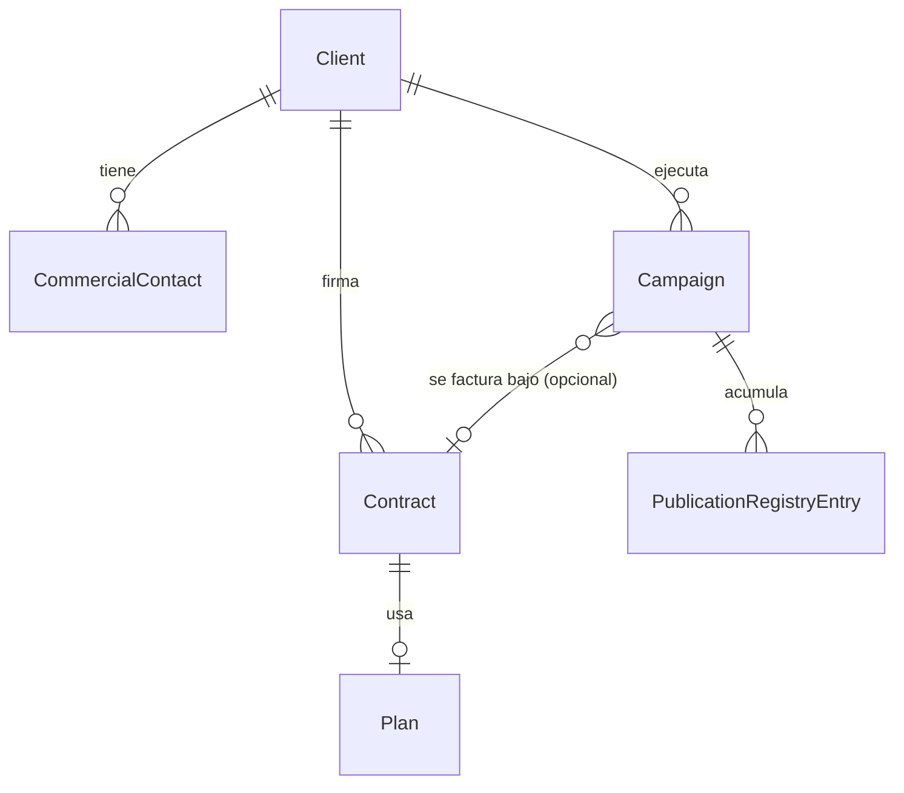

# Commercial Manager

> Diseñado en Sprint 3A, a implementar en Sprint 3B (núcleo) y Sprint 3C
> (dashboard) — ver [docs/roadmap/v1-roadmap.md](../roadmap/v1-roadmap.md).
> Ver [ADR-004](../adr/ADR-004-commercial-manager.md) para el razonamiento
> completo.

## Qué es

El bounded context que administra la relación comercial de Portal Vallenato
con quienes pagan (o tienen un acuerdo) por espacio editorial: managers,
artistas, empresas. Es la contraparte de negocio de por qué la mayoría del
contenido que procesa el sistema no viene de Discovery — ver
[docs/product/PRODUCT_VISION.md](../product/PRODUCT_VISION.md).

**No es un agente.** Es un contexto de gestión con sus propias entidades y
reglas, más parecido a Editorial que a `agents/telegram/` o
`agents/writer/`.

## Entidades

| Entidad | Responsabilidad |
|---|---|
| `Client` | El cliente comercial — manager, artista, empresa. **No es `MediaOutlet`** — ver [ADR-004](../adr/ADR-004-commercial-manager.md), Decisión 1. |
| `CommercialContact` | La persona que físicamente envía contenido (por WhatsApp, hoy) — puede no estar vinculada a un `Client` todavía. |
| `Contract` | El acuerdo comercial: qué `Plan`, desde/hasta cuándo, estado. |
| `Plan` | La oferta comercial: cuota mensual incluida, precio, canales incluidos. |
| `Campaign` | La unidad operativa real — el trabajo que se está ejecutando para un `Client`, con o sin `Contract` asociado. Ver [ADR-004](../adr/ADR-004-commercial-manager.md), Decisión 3. |
| `PublicationRegistryEntry` | El registro de que un `Article` de una `Campaign` llegó a `ArticleStatus.PUBLISHED` — la fuente de verdad para calcular cuota consumida. |
| `Alert` | Cuota superada, contrato por vencer, u otras condiciones que requieren atención humana. |

## Cómo se calcula la cuota

No hay un contador que se incrementa. La cuota consumida de una `Campaign`
en un periodo se **deriva** contando sus `PublicationRegistryEntry`. Si la
`Campaign` tiene `Contract` asociado, se compara ese conteo contra
`Plan.monthly_quota`. Si no tiene `Contract`, no hay cuota que vigilar —
es un estado de negocio válido (cortesía, prueba, trabajo previo a
formalizar), no un error. Ver
[ADR-004](../adr/ADR-004-commercial-manager.md), Decisión 4.

## Cómo se integra con el resto del sistema

- **Con Publication Inbox** (ver
  [docs/architecture/publication-inbox.md](publication-inbox.md)):
  `PublicationRequest.client_id`/`campaign_id`/`commercial_contact_id` son
  referencias por ID, resueltas por el canal WhatsApp o por triage humano.
  Commercial Manager nunca importa `core.entities.publication_request` ni
  viceversa.
- **Con Editorial:** cuando un `Article` originado de una `Campaign` llega
  a `ArticleStatus.PUBLISHED`, un `workflow` (nunca `core/` directamente)
  crea el `PublicationRegistryEntry` correspondiente. Sin event bus (ver
  [docs/ARCHITECTURE.md](../ARCHITECTURE.md), sección "Eventos de
  dominio"), esta llamada es explícita, igual que hoy `workflows/`
  coordina WordPress → Telegram.

## Cómo evolucionará

En orden de dependencia (y el orden decidido en Sprint 3A: núcleo comercial
antes que integraciones de canal):

1. **Núcleo** (Sprint 3B): `Client`, `CommercialContact`, `Contract`,
   `Plan`, `Campaign` como entidades (`frozen=True`, mismo estilo que
   `core/entities/` hoy), repositorios concretos reutilizando
   `core.ports.repository.Repository[T]` sin cambios, tests con fakes en
   memoria — sin depender todavía de Publication Inbox ni de ningún canal.
2. **Dashboard comercial** (Sprint 3C): primera vista de solo lectura
   sobre clientes, contratos, campañas activas y cuota restante. Alcance
   técnico (script de reporte vs. panel interno) a definir en su propio
   ADR cuando se llegue a este sprint, siguiendo el mismo criterio que ya
   aplica el sprint "Dashboard" editorial en
   [docs/roadmap/v1-roadmap.md](../roadmap/v1-roadmap.md) — no se
   introduce FastAPI sin una necesidad concreta que lo justifique.
3. **Publication Inbox** (Sprint 3D en adelante) empieza a alimentar
   `campaign_id`/`client_id` reales.
4. **`PublicationRegistryEntry` automático + `Alert`** (Sprint 3G): wiring
   en `workflows/` para registrar publicaciones y disparar alertas de
   cuota/vencimiento.
