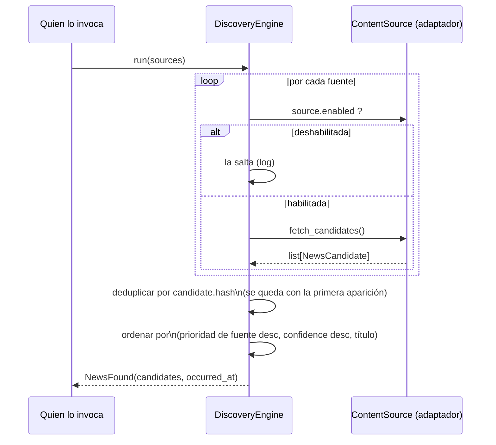

# Discovery Engine

> Implementado en Sprint 2 (`core/services/discovery_engine.py`). Este
> documento explica qué hace, qué no hace y cómo evolucionará. Para el
> resumen dentro del panorama arquitectónico completo, ver
> [docs/ARCHITECTURE.md](../ARCHITECTURE.md), sección "Discovery Engine".

## Qué es

`core.services.discovery_engine.DiscoveryEngine` es un servicio de
dominio sin estado (salvo un reloj inyectable para pruebas) que convierte
un conjunto de fuentes en **una pasada de descubrimiento**: candidatos
recolectados, deduplicados y ordenados.

**No es el agente Radar.** Es el motor que el agente Radar usará una vez
que exista — ver [agents/radar/README.md](../../agents/radar/README.md).

## Qué hace

Paso a paso:

1. **Recibe** una colección de adaptadores `core.ports.content_source.ContentSource`.
2. **Filtra** las fuentes con `source.enabled == False` (no las consulta).
3. **Solicita candidatos** a cada fuente habilitada
   (`fetch_candidates() -> list[NewsCandidate]`).
4. **Deduplica** por `NewsCandidate.hash` — huella de contenido calculada
   por el adaptador vía `core.services.deduplication.generate_candidate_hash`,
   quedándose con la primera aparición.
5. **Ordena** el resultado: prioridad de la fuente (`Source.priority`)
   primero, luego `confidence` del candidato, luego título (para que el
   orden sea determinístico).
6. **Devuelve** un evento `core.events.news_found.NewsFound` con la lista
   final y una marca de tiempo (`occurred_at`).
7. **Registra** cada paso relevante vía `shared/logger.py` (fuentes
   saltadas, candidatos por fuente, duplicados descartados) — ver
   [docs/PROJECT_RULES.md](../PROJECT_RULES.md), regla 6.

## Qué NO hace

- **No hace scraping.** No sabe qué es HTTP, HTML, RSS ni Playwright. Eso
  es responsabilidad de cada adaptador `ContentSource` concreto.
- **No usa IA.** No decide relevancia, no resume, no reescribe nada.
- **No persiste nada.** No hay base de datos involucrada.
- **No deduplica entre ejecuciones.** Solo deduplica *dentro de una misma
  pasada* (`run()`). Si se ejecuta dos veces, la segunda vez volverá a
  devolver los mismos candidatos si la fuente los sigue reportando — la
  deduplicación contra el historial editorial persistido es trabajo de
  `core.ports.repository.Repository`, que todavía no está conectado aquí.
- **No dispara nada a un event bus.** No existe un event bus en el
  proyecto (ver [docs/ARCHITECTURE.md](../ARCHITECTURE.md), sección
  "Eventos de dominio"). "Disparar" el evento `NewsFound` hoy significa,
  literalmente, devolverlo como resultado de `run()`.
- **No decide qué pasa después.** No llama al Extractor, no notifica a
  nadie. Eso es trabajo de un `workflow` futuro.

## Cómo se prueba sin red

`tests/fakes/FakeContentSource` implementa el mismo `Protocol`
`ContentSource` pero lee archivos JSON de `tests/fixtures/` en lugar de
una fuente real. Nunca se importa desde código de producción — solo desde
`tests/`. Esto permite probar el motor completo (recolección, dedup,
orden, emisión del evento) sin internet, sin credenciales y sin mocks
frágiles. Ver `tests/integration/test_discovery_engine_with_fixtures.py`.

## Cómo evolucionará

En orden de dependencia, no necesariamente de prioridad:

1. **Un `ContentSource` real** (por ejemplo, un lector RSS) — ver
   [docs/roadmap/v1-roadmap.md](../roadmap/v1-roadmap.md), sprint "RSS".
   `DiscoveryEngine` no cambia: solo se le pasa un adaptador nuevo.
2. **Conexión con `Repository`** para deduplicar contra el historial
   editorial persistido entre ejecuciones, no solo dentro de una pasada.
   Probablemente se resuelva en el agente Radar (que envuelve al motor),
   no dentro del motor mismo, para mantenerlo libre de infraestructura.
3. **El agente Radar** (`agents/radar/`): construye los `ContentSource`
   reales a partir de la configuración de `Source` persistida, llama a
   `DiscoveryEngine.run()`, y entrega el `NewsFound` resultante al
   Extractor.
4. **Un `workflow`** que encadene Radar → Extractor → ... → WordPress →
   Telegram, con el punto de aprobación humana intacto.
5. **Scheduler** (fase posterior): ejecuta ese workflow con una cadencia
   configurable.

Nada de esto requiere cambiar la firma pública de `DiscoveryEngine.run()`
— es exactamente el punto de construirlo detrás de un `Protocol`.
