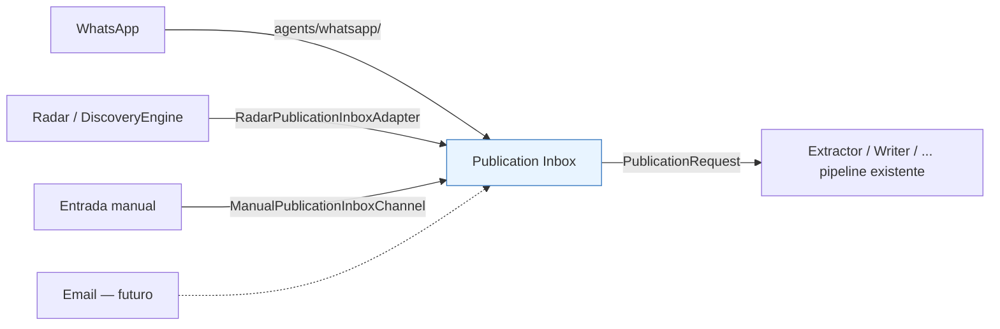

# Publication Inbox

> Diseñado en Sprint 3A, a implementar en Sprint 3D (ver
> [docs/roadmap/v1-roadmap.md](../roadmap/v1-roadmap.md)). Este documento
> explica qué es, qué no es, y cómo se conecta con Discovery y con
> Commercial Manager. Ver [ADR-003](../adr/ADR-003-publication-inbox.md)
> para el razonamiento completo detrás de cada decisión.

## Qué es

Publication Inbox es el bounded context que convierte **cualquier** canal
de entrada de contenido — WhatsApp, Radar, entrada manual, y a futuro
Email — en una forma única: `PublicationRequest`. Es la frontera entre "de
dónde vino el contenido" y "el pipeline editorial existente", que sigue
funcionando exactamente igual a partir de ahí (Extractor → Writer → SEO →
Images → WordPress → Telegram → aprobación humana).

**No es un agente en el sentido tradicional del proyecto.** Es un bounded
context con su propia entidad, puerto y adaptadores — más parecido a
Discovery que a un agente individual de una sola responsabilidad mecánica.

## Qué hace

1. Cada canal implementa `core.ports.publication_inbox_channel.PublicationInboxChannel`
   (`Protocol`, análogo a `ContentSource`) y produce `list[PublicationRequest]`.
2. Radar es un caso especial: no habla directamente con Publication Inbox.
   `DiscoveryEngine.run()` sigue funcionando exactamente igual (ver
   [docs/architecture/discovery-engine.md](discovery-engine.md)); un
   adaptador (`RadarPublicationInboxAdapter`) traduce cada `NewsCandidate`
   del `NewsFound` resultante a un `PublicationRequest` con
   `origin=RADAR`, `is_commercial=False`.
3. Un editor o responsable comercial hace **triage**: revisa cada
   `PublicationRequest` en `RECEIVED`, opcionalmente resuelve
   `client_id`/`campaign_id`/`commercial_contact_id` si no llegaron
   resueltos, y decide `ACCEPTED` (nace un `Article` en `DRAFT`),
   `REJECTED` o `DUPLICATE`.
4. A partir de `ACCEPTED`, el flujo es indistinguible del actual: el
   `Article` resultante no sabe ni le importa si vino de WhatsApp o de un
   RSS.

## Qué NO hace

- No decide relevancia ni calidad — eso sigue siendo trabajo editorial
  humano (triage) o, para contenido orgánico, de `EditorialAssessment`
  (ver [ADR-002](../adr/ADR-002-editorial-assessment.md)) una vez que
  exista un `Article`.
- No reemplaza `DiscoveryEngine` ni cambia su comportamiento — lo envuelve.
- No resuelve identidad comercial de forma automática garantizada — el
  matching de `commercial_contact_id` por teléfono es un mejor esfuerzo;
  la resolución final es humana.
- No persiste por sí mismo un historial de deduplicación entre
  ejecuciones — igual que Discovery hoy, eso es trabajo de
  `core.ports.repository.Repository`, conectado en el sprint de
  Persistence correspondiente.

## Relación con Commercial Manager

Publication Inbox y Commercial Manager (ver
[docs/architecture/commercial-manager.md](commercial-manager.md)) son
bounded contexts distintos, conectados solo por referencias de ID:
`PublicationRequest.client_id`, `campaign_id`, `commercial_contact_id`.
Ninguno importa entidades del otro — ver
[ADR-004](../adr/ADR-004-commercial-manager.md), Decisión 5.

## Cómo evolucionará

En orden de dependencia:

1. **`PublicationRequest`, `MediaAsset`, `RequestOrigin`, el puerto
   `PublicationInboxChannel` y el evento `PublicationRequestReceived`**
   (Sprint 3D) — construidos *después* de Commercial Manager Core (Sprint
   3B) para que `client_id`/`campaign_id` referencien algo real desde el
   principio.
2. **`ManualPublicationInboxChannel`** (Sprint 3D) — el adaptador más
   simple, sin dependencias externas, para validar el puerto con tests
   (el mismo rol que cumplió `FakeContentSource` para `ContentSource`,
   pero pensado para uso real por el equipo comercial, no solo pruebas).
3. **`RadarPublicationInboxAdapter`** (Sprint 3E).
4. **`agents/whatsapp/`** (Sprint 3F) — adaptador real contra WhatsApp
   Business API.
5. **Conexión con `Repository`** para persistir el historial de
   `PublicationRequest` entre ejecuciones — sprint de Persistence.
