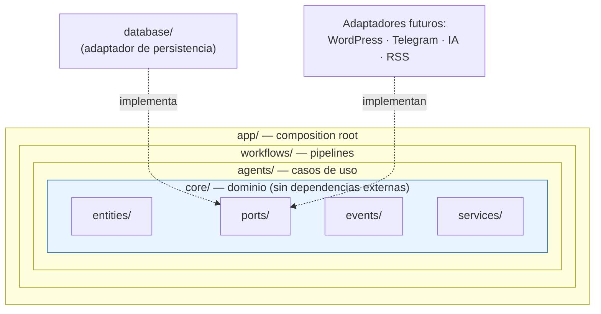
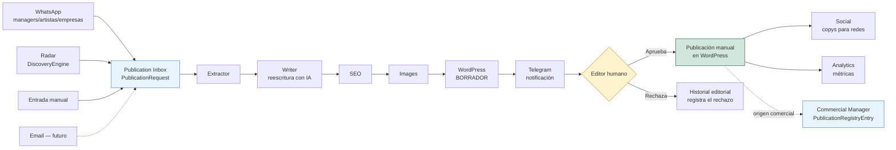

# Visión general del sistema

> Este documento es el punto de entrada visual a la arquitectura. Para el
> razonamiento completo detrás de cada decisión, ver
> [docs/ARCHITECTURE.md](../ARCHITECTURE.md) y
> [docs/adr/ADR-001-project-vision.md](../adr/ADR-001-project-vision.md).

## Visión general

Portal Newsroom AI es un conjunto de **agentes especializados**,
coordinados por **workflows** determinísticos, construidos sobre un
**dominio** (`core/`) que no depende de ninguna librería de
infraestructura. Cada agente resuelve una responsabilidad del flujo
editorial; ninguno publica contenido por sí mismo.

Las flechas de dependencia siempre apuntan hacia adentro: `app` conoce a
`workflows`, `workflows` conoce a `agents`, `agents` conocen `core` — pero
`core` no conoce a nadie por fuera de sí mismo.

## Flujo del sistema (visión completa, extremo a extremo)

**El único punto donde el contenido sale del sistema hacia el público es
el rombo "Editor humano → Publicación manual".** Ningún nodo anterior
publica nada — ver [docs/PROJECT_RULES.md](../PROJECT_RULES.md), regla 1.

**Desde `Extractor` en adelante, el flujo es idéntico sin importar el
canal de entrada** — ver
[docs/architecture/publication-inbox.md](publication-inbox.md) y
[ADR-003](../adr/ADR-003-publication-inbox.md). Cuando el `Article`
resultante tiene origen comercial (`PublicationRequest.is_commercial`), su
publicación además genera un `PublicationRegistryEntry` en Commercial
Manager (ver [docs/architecture/commercial-manager.md](commercial-manager.md))
— sin que Editorial ni Publication Inbox importen nada de ese contexto.

**Estado actual (Sprint 3A):** solo Radar/`DiscoveryEngine` existe en
código (ver
[docs/architecture/discovery-engine.md](discovery-engine.md)). Publication
Inbox y Commercial Manager están diseñados (Sprint 3A) pero no
implementados — ver
[docs/roadmap/v1-roadmap.md](../roadmap/v1-roadmap.md) para el orden de
construcción. Todo lo demás en el diagrama sigue siendo diseño, no código.

## Agentes y responsabilidades

| Agente | Responsabilidad | Port principal | Estado |
|---|---|---|---|
| `radar` | Detectar noticias nuevas (canal de Publication Inbox) | `ContentSource`, `Repository`, `DiscoveryEngine` | 🟡 Motor listo, agente no |
| `whatsapp` | Recibir solicitudes comerciales (canal de Publication Inbox) | `PublicationInboxChannel` | ⬜ No implementado (diseñado, Sprint 3A) |
| `extractor` | Extraer contenido estructurado completo | `ContentExtractor` | ⬜ No implementado |
| `writer` | Reescribir con estilo editorial | `AIProvider` | ⬜ No implementado |
| `seo` | Generar metadatos SEO | `AIProvider` | ⬜ No implementado |
| `images` | Gestionar imágenes | `ImageProvider` | ⬜ No implementado |
| `wordpress` | Crear borradores en el CMS | `CMSPublisher` | ⬜ No implementado |
| `telegram` | Notificar al equipo editorial | `Notifier` | ⬜ No implementado |
| `scheduler` | Ejecutar pipelines periódicamente | usa `workflows/` | ⬜ No implementado |
| `social` | Generar contenido para redes | `AIProvider` | ⬜ No implementado |
| `analytics` | Métricas editoriales | `Repository` | ⬜ No implementado |
| `orchestrator` | Coordinación inteligente multi-agente | todos los anteriores | ⬜ No implementado |

Detalle de cada agente en su propio `agents/<nombre>/README.md`. Plan de
entrega de cada uno en
[docs/roadmap/v1-roadmap.md](../roadmap/v1-roadmap.md).

## Capas, de adentro hacia afuera

1. **`core/`** — entidades (`NewsCandidate`, `Source`, `Article`,
   `EditorialTask`), contratos (`ports/`), eventos de dominio (`events/`),
   servicios de dominio (`services/`). Cero dependencias externas.
2. **`agents/`** — un paquete por responsabilidad, cada uno depende solo
   de los `ports` que necesita.
3. **`workflows/`** — composición determinística de agentes en pipelines
   de negocio completos.
4. **`database/`**, y futuras integraciones (WordPress, Telegram,
   proveedores de IA, lectores RSS) — adaptadores que implementan los
   `ports` de `core/`.
5. **`app/`** — composition root: la única capa que conoce todo el grafo
   de dependencias y las conecta.

## Ver también

- [docs/ARCHITECTURE.md](../ARCHITECTURE.md) — razonamiento completo y
  detalle carpeta por carpeta.
- [docs/architecture/discovery-engine.md](discovery-engine.md) — el único
  motor implementado hasta ahora.
- [docs/architecture/publication-inbox.md](publication-inbox.md) y
  [docs/architecture/commercial-manager.md](commercial-manager.md) — los
  dos bounded contexts diseñados en Sprint 3A, todavía no implementados.
- [docs/business/editorial-workflow.md](../business/editorial-workflow.md) —
  el mismo flujo, visto desde la perspectiva del equipo editorial.
