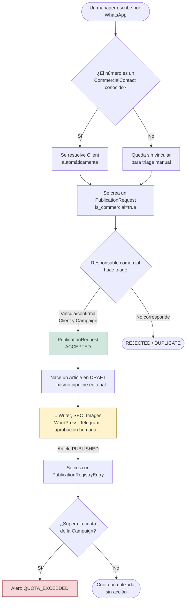

# Flujo comercial

> Documento de negocio: describe el flujo **esperado** una vez que
> Commercial Manager y Publication Inbox existan (ver
> [docs/roadmap/v1-roadmap.md](../roadmap/v1-roadmap.md) para qué existe
> hoy — nada de este flujo está implementado todavía, Sprint 3A es solo
> diseño). Para la vista técnica, ver
> [docs/architecture/commercial-manager.md](../architecture/commercial-manager.md)
> y [docs/architecture/publication-inbox.md](../architecture/publication-inbox.md).
> Complementa a [docs/business/editorial-workflow.md](editorial-workflow.md),
> que sigue siendo válido desde el punto donde ambos flujos convergen.

## De un mensaje de WhatsApp a una campaña con cuota vigilada

## Los puntos que no son negociables

1. **El triage sigue siendo humano.** Nada se acepta automáticamente por
   venir de un `Client` conocido — un responsable comercial confirma cada
   `PublicationRequest` antes de que nazca un `Article`. Ver
   [ADR-003](../adr/ADR-003-publication-inbox.md).
2. **A partir de `ACCEPTED`, no hay atajos.** El `Article` resultante pasa
   por el mismo pipeline, la misma aprobación editorial humana y las
   mismas reglas que cualquier contenido orgánico — ver
   [docs/business/editorial-workflow.md](editorial-workflow.md). Ser un
   cliente que paga no exime de revisión editorial.
3. **Una campaña sin contrato no es un error.** Si `Campaign.contract_id`
   es `None`, simplemente no hay cuota que vigilar para ese trabajo — ver
   [ADR-004](../adr/ADR-004-commercial-manager.md), Decisión 3.
4. **`Alert` informa, no bloquea.** Superar la cuota de una `Campaign`
   genera una alerta para que un humano decida (¿se factura de más? ¿se
   pausa la campaña? ¿se renegocia?) — nunca detiene automáticamente el
   pipeline editorial de un `PublicationRequest` ya aceptado.

## Roles humanos involucrados

- **Responsable comercial**: hace triage de los `PublicationRequest`
  entrantes, vincula `Client`/`Campaign`/`CommercialContact` cuando no
  llegan resueltos, atiende las `Alert`.
- **Editor de turno**: desde `PublicationRequest.ACCEPTED` en adelante, el
  mismo rol que ya describe
  [docs/business/editorial-workflow.md](editorial-workflow.md) — no
  distingue si el `Article` que revisa es de origen comercial u orgánico.

## Qué existe hoy de este flujo

Nada todavía — Sprint 3A es diseño puro. El orden de construcción real
está en [docs/roadmap/v1-roadmap.md](../roadmap/v1-roadmap.md): primero el
núcleo de Commercial Manager y su dashboard (para poder administrar
clientes/campañas antes de que exista ningún canal conectado), después
Publication Inbox, y al final las integraciones de canal (Radar,
WhatsApp) y el wiring del registro/alertas.
