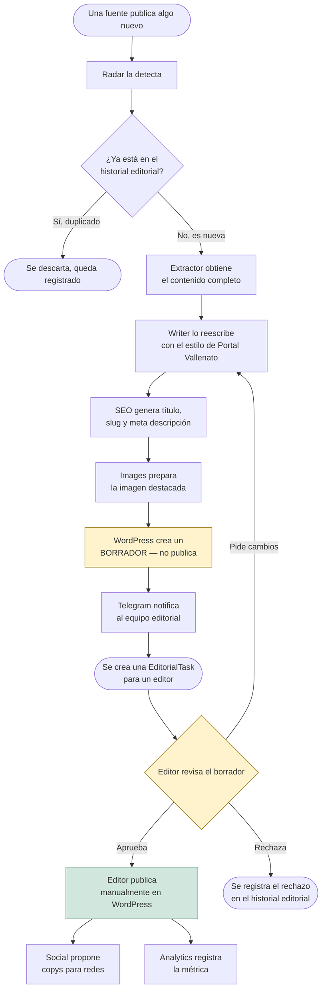

# Flujo editorial

> Documento de negocio: describe el flujo **esperado** una vez que todos
> los agentes existan (ver [docs/roadmap/v1-roadmap.md](../roadmap/v1-roadmap.md)
> para qué existe hoy). Para la vista técnica del mismo flujo, ver
> [docs/architecture/system-overview.md](../architecture/system-overview.md).

## De la aparición de una noticia a WordPress

## Los puntos que no son negociables

1. **Nada se publica sin que un humano lo decida.** El sistema llega,
   como máximo, hasta "borrador creado + notificación enviada". La flecha
   `K → L` (aprobar → publicar) es una acción humana en WordPress, no una
   llamada de API que el sistema ejecuta. Ver
   [docs/PROJECT_RULES.md](../PROJECT_RULES.md), regla 1.
2. **Ninguna noticia se procesa dos veces.** El chequeo de duplicado
   (`C`) ocurre antes de gastar tiempo de extracción o de IA en algo que
   el equipo ya vio.
3. **Todo queda registrado.** Detectado, descartado por duplicado,
   reescrito, borrador creado, aprobado, rechazado — cada paso es
   historial editorial auditable, no solo el resultado final.
4. **Un editor puede pedir cambios sin reiniciar el proceso.** El flujo
   contempla volver de "Editor revisa" a "Writer reescribe" sin perder el
   trabajo de detección y extracción ya hecho.

## Roles humanos involucrados

- **Editor de turno**: revisa las notificaciones de Telegram, abre el
  borrador en WordPress, decide aprobar, pedir cambios o rechazar.
- **Encargado de redes**: revisa las propuestas de Social antes de
  publicarlas (mismo principio: el sistema propone, un humano publica).
- **Editor jefe / dirección**: consulta Analytics para entender volumen
  procesado, tiempo ahorrado y tasa de aprobación — no interviene en cada
  artículo individual.

## Qué existe hoy de este flujo

Solo el primer tramo: Radar/`DiscoveryEngine` (detección + descarte de
duplicados **dentro de una misma pasada** — la deduplicación contra el
historial persistido todavía no está conectada, ver
[docs/architecture/discovery-engine.md](../architecture/discovery-engine.md)).
Todo lo que sigue (`D` en adelante) es diseño, no código. El estado real,
sprint por sprint, está en
[docs/roadmap/v1-roadmap.md](../roadmap/v1-roadmap.md).
