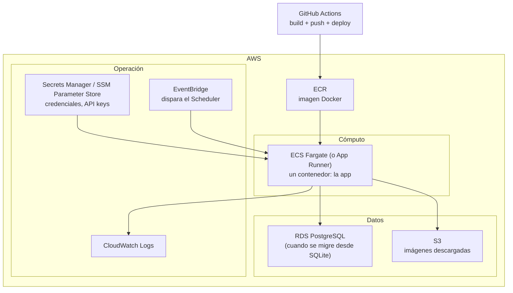

# Estrategia de despliegue en AWS (propuesta, no implementada)

> Este documento describe **una dirección propuesta**, no una decisión
> cerrada ni una implementación. Nada de lo descrito aquí existe todavía
> en el proyecto. Se revisará y se formalizará como ADR cuando el proyecto
> se acerque al sprint "Dashboard" / v1.0 (ver
> [docs/roadmap/v1-roadmap.md](../roadmap/v1-roadmap.md)).

## Contexto

Portal Newsroom AI es una herramienta interna para un medio regional, no
un producto de alto tráfico. La estrategia de despliegue debe priorizar
**costo bajo y operación simple** sobre escalabilidad masiva — no hay
ningún requisito de negocio hoy que justifique arquitecturas complejas
(Kubernetes, multi-región, autoscaling agresivo).

## Componentes propuestos

- **Cómputo**: contenedor único (reutilizando `docker/Dockerfile`, ya
  existente) en **ECS Fargate** o, si el volumen no lo justifica, algo
  todavía más simple como **AWS App Runner**. Sin servidores que
  administrar manualmente.
- **Base de datos**: SQLite (MVP actual) puede vivir en un volumen
  persistente mientras el volumen de datos sea bajo. La migración a
  **RDS PostgreSQL** (ya prevista en [docs/ROADMAP.md](../ROADMAP.md),
  sección "Futuro") se activa cuando concurrencia o tamaño de datos lo
  requieran — es un cambio de `DATABASE_URL`, no de código, por diseño
  (ver `database/engine.py`).
- **Imágenes**: el agente Images (futuro) probablemente suba las
  imágenes descargadas a **S3** en vez de al disco del contenedor, para
  que sobrevivan a un redeploy.
- **Secretos**: `WORDPRESS_APP_PASSWORD`, `TELEGRAM_BOT_TOKEN`,
  `OPENAI_API_KEY` / `ANTHROPIC_API_KEY` nunca viajan en la imagen ni en
  variables de entorno planas en producción — **Secrets Manager** o
  **SSM Parameter Store**, inyectados al contenedor en runtime. El
  `.env` local (ver `.env.example`) sigue siendo solo para desarrollo.
- **Logs**: salida de `shared/logger.py` hacia **CloudWatch Logs** — ver
  [docs/operations/logging.md](../operations/logging.md) para el formato
  propuesto.
- **Programación**: el futuro agente Scheduler se dispara vía
  **EventBridge** (cron administrado), no un proceso `while True: sleep()`
  corriendo indefinidamente.
- **CI/CD**: GitHub Actions construye la imagen (`docker/Dockerfile`), la
  publica en **ECR** y actualiza el servicio — pendiente de definir el
  pipeline exacto cuando se implemente.

## Qué NO se propone (y por qué)

- **Kubernetes / EKS**: complejidad operativa que no se justifica para
  un único contenedor de bajo tráfico.
- **Multi-región / alta disponibilidad activa-activa**: no hay
  requisito de negocio para esto; una interrupción breve de un servicio
  interno editorial no es crítica de la misma forma que lo sería para un
  producto de cara al público.
- **Autoscaling agresivo**: el volumen de trabajo (pipelines editoriales
  periódicos) es predecible, no picos de tráfico impredecibles.

## Pendiente de decidir (fuera de alcance de este documento)

- Cuenta de AWS y estructura de facturación.
- Región (probablemente la más cercana/económica para el equipo).
- Si App Runner es suficiente o si hace falta el control adicional de
  ECS Fargate.
- Pipeline exacto de CI/CD en GitHub Actions.

## Ver también

- [docs/roadmap/v1-roadmap.md](../roadmap/v1-roadmap.md) — cuándo entra
  esto en alcance.
- `docker/Dockerfile`, `docker-compose.yml` — lo único que existe hoy en
  materia de despliegue (ejecución local en Docker).
