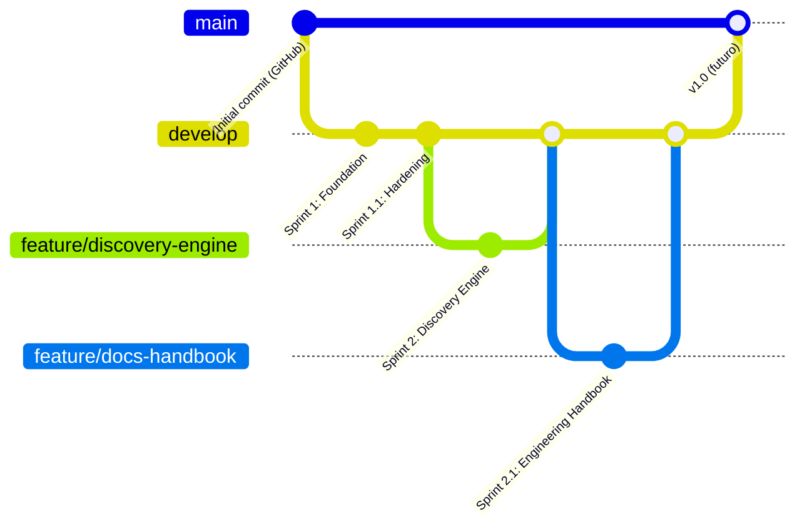

# Estrategia de ramas (Git Flow simplificado)

## Modelo

Tres tipos de rama, cada una con un propósito:

### `main`

Rama de producción. Representa lo que está desplegado / listo para
desplegar. Recibe merges únicamente desde `develop`, y solo en hitos de
release (ver [docs/roadmap/v1-roadmap.md](../roadmap/v1-roadmap.md)).
**Todavía no existe ningún despliegue** (ver
[docs/deployment/aws.md](../deployment/aws.md)), así que hoy `main` es el
destino planeado, no una rama activa.

### `develop`

Rama de integración. Es el estado real y siempre-actualizado del
proyecto — todo sprint terminado y verificado vive aquí. Es la base desde
la que se crean todas las ramas `feature/`.

### `feature/<nombre-corto>`

Una rama por sprint o por tarea de alcance acotado, creada desde
`develop`. Vive hasta que el trabajo está verificado (tests, `ruff`,
`mypy` en verde — ver [docs/development/code-review.md](code-review.md))
y se integra de vuelta a `develop`. Después se puede borrar.

Otros prefijos, para trabajo que no es una funcionalidad completa (ver
[CONTRIBUTING.md](../../CONTRIBUTING.md)):

- `fix/<nombre-corto>` — correcciones puntuales.
- `docs/<nombre-corto>` — documentación (como este mismo sprint).
- `chore/<nombre-corto>` — mantenimiento, dependencias, configuración.

## Estado real de las ramas hoy

- `develop` — rama de integración activa. Contiene Sprint 1 (Foundation),
  Sprint 1.1 (Hardening) y Sprint 2 (Discovery Engine).
- `feature/discovery-engine` — Sprint 2, ya integrada a `develop`.
- `master` — rama placeholder creada automáticamente por GitHub al crear
  el repositorio (contiene solo un `README.md` genérico). **No es la
  rama de producción** de este proyecto; es un remanente del alta del
  repositorio en GitHub, pendiente de retirar o renombrar a `main` cuando
  el proyecto llegue a su primer release real.

## Convención de commits

[Conventional Commits](https://www.conventionalcommits.org/):
`feat:`, `fix:`, `docs:`, `refactor:`, `test:`, `chore:` — ver
[docs/CODING_STANDARDS.md](../CODING_STANDARDS.md), sección "Commits".

## Ver también

- [CONTRIBUTING.md](../../CONTRIBUTING.md) — flujo completo de
  contribución, incluyendo checklist previo a un Pull Request.
- [docs/development/code-review.md](code-review.md) — qué se revisa antes
  de integrar una rama `feature/` a `develop`.
