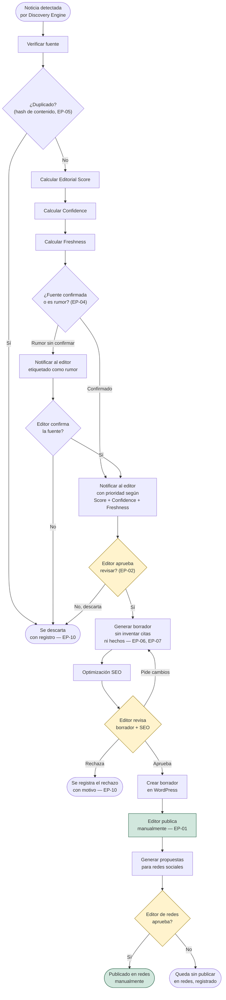

# Árbol de decisión editorial

> El flujo completo, integrando [EDITORIAL_POLICIES.md](EDITORIAL_POLICIES.md),
> [EDITORIAL_SCORE.md](EDITORIAL_SCORE.md),
> [CONFIDENCE_MODEL.md](CONFIDENCE_MODEL.md) y
> [FRESHNESS_MODEL.md](FRESHNESS_MODEL.md) en un solo proceso. Es una
> versión más detallada, a nivel de decisión editorial, del flujo de
> [docs/business/editorial-workflow.md](../business/editorial-workflow.md)
> (que describe el mismo recorrido a nivel de negocio general).

## El flujo

## Los puntos de decisión, explicados

| Paso | Quién decide | Con qué información |
|---|---|---|
| ¿Duplicado? | El sistema (mecánico, no editorial) | Huella de contenido — ver [docs/architecture/discovery-engine.md](../architecture/discovery-engine.md) |
| ¿Fuente confirmada o rumor? | El sistema marca; el editor confirma | Metadatos de la fuente + Confidence |
| ¿Editor aprueba revisar? | Editor humano | Score, Confidence, Freshness combinados — ver [CONFIDENCE_MODEL.md](CONFIDENCE_MODEL.md) |
| Editor revisa borrador + SEO | Editor humano | El borrador generado, no solo las señales previas |
| Editor de redes aprueba | Editor de redes (ver [EDITOR_PERSONAS.md](EDITOR_PERSONAS.md)) | El artículo ya publicado + las propuestas generadas |

Cada rombo amarillo en el diagrama es un punto donde un humano decide —
ninguno es una bifurcación automática basada solo en umbrales numéricos.
Score, Confidence y Freshness **informan** la decisión (orden, prioridad,
contexto en la notificación); no la toman.

## Qué pasa con lo que se descarta

Ningún camino de este árbol termina en "se borra sin dejar rastro". Todo
descarte (`Z1`, `Z2`) queda en el historial editorial con su motivo — es
lo que permite calcular tasas de duplicados y de rechazo en
[KPIS.md](KPIS.md) con datos reales.

## Estado de implementación

Hoy, en código, solo existen los primeros pasos: detección y
deduplicación **dentro de una misma pasada** (`DiscoveryEngine`, Sprint
2). Todo lo que sigue — Score, Confidence real (más allá del campo que
ya existe), Freshness, generación de borrador, SEO, WordPress, redes —
es diseño, no implementación. Ver
[docs/product/MVP_SCOPE.md](../product/MVP_SCOPE.md) y
[docs/ROADMAP.md](../ROADMAP.md) para el orden en que se construye cada
parte.
