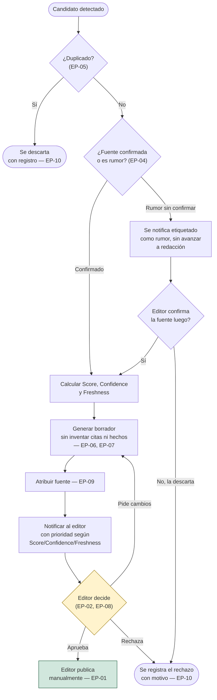

# Políticas editoriales obligatorias

> Aplican el principio de [HUMAN_IN_THE_LOOP.md](HUMAN_IN_THE_LOOP.md) a
> reglas de negocio concretas y numeradas, para que cualquier documento o
> agente futuro pueda referenciarlas sin ambigüedad (`EP-01`, `EP-02`,
> ...). Ninguna de estas políticas es negociable por configuración de
> cliente — ver [docs/product/CUSTOMER_CONFIGURATION.md](../product/CUSTOMER_CONFIGURATION.md):
> lo que varía por cliente es el *estilo*, nunca estas garantías.

## Las políticas

### EP-01 — La IA nunca publica automáticamente

Ningún componente del sistema tiene la capacidad técnica de publicar
contenido sin una acción humana explícita. Esta es la política de la que
dependen todas las demás — ver
[docs/PROJECT_RULES.md](../PROJECT_RULES.md), regla 1.

### EP-02 — Todo artículo requiere aprobación editorial

Ningún `Article` llega al estado `PUBLISHED` sin que un `Editor` (ver
[EDITOR_PERSONAS.md](EDITOR_PERSONAS.md)) lo haya aprobado explícitamente.
No existe una ruta de "aprobación automática" para ningún nivel de Score,
Confidence o Freshness, sin importar cuán altos sean — ver
[EDITORIAL_DECISION_TREE.md](EDITORIAL_DECISION_TREE.md).

### EP-03 — Las fuentes oficiales tienen mayor confianza

Una fuente verificada como oficial (comunicado directo de una institución,
artista o su representante) parte de una Confidence más alta que una
fuente de segunda mano — ver
[CONFIDENCE_MODEL.md](CONFIDENCE_MODEL.md). Esto **no** exime de
aprobación humana (EP-02); solo cambia cuánta urgencia y contexto recibe
al notificar al editor.

### EP-04 — Los rumores requieren confirmación antes de avanzar

Un candidato cuya fuente no está verificada, o cuyo contenido se presenta
como no confirmado por la fuente misma, no avanza a redacción de borrador
hasta que un editor lo marque como confirmado. Se notifica igual —
etiquetado explícitamente como rumor — para que el editor decida si vale
la pena verificarlo, no para que el sistema decida esperar en silencio.

### EP-05 — Las noticias duplicadas nunca se publican dos veces

Ningún candidato cuya huella de contenido (`NewsCandidate.hash`, ver
[docs/architecture/discovery-engine.md](../architecture/discovery-engine.md))
coincida con un artículo ya procesado avanza a redacción. Hoy esta
garantía es parcial: `DiscoveryEngine` deduplica dentro de una misma
pasada; la deduplicación contra el historial persistido entre ejecuciones
depende de `core.ports.repository.Repository`, todavía no conectado (ver
[docs/product/MVP_SCOPE.md](../product/MVP_SCOPE.md), "Deuda técnica
reconocida"). Un duplicado detectado siempre queda registrado, nunca
desaparece sin dejar rastro — ver
[docs/PROJECT_RULES.md](../PROJECT_RULES.md), regla 11.

### EP-06 — La IA nunca inventa citas

Ninguna cita textual puede aparecer en un borrador si no está presente,
palabra por palabra o como paráfrasis explícitamente marcada como tal, en
el contenido extraído de la fuente. Ver
[docs/editorial/ai-writing-rules.md](ai-writing-rules.md), sección
"Fuentes".

### EP-07 — La IA nunca fabrica hechos

Ningún dato, cifra o afirmación puede aparecer en un borrador si no
proviene del contenido extraído. Si la información es ambigua o
incompleta, el borrador debe reflejar esa ambigüedad, no resolverla con
una suposición plausible. Ver
[docs/editorial/style-guide.md](style-guide.md), Principio 1.

### EP-08 — La aprobación humana es obligatoria, sin excepción de urgencia

Ni siquiera una noticia de última hora (Freshness máxima, ver
[FRESHNESS_MODEL.md](FRESHNESS_MODEL.md)) se publica sin aprobación. La
urgencia cambia cuán rápido se notifica y cuánta prioridad recibe en la
bandeja de un editor — nunca cambia si se requiere su aprobación.

### EP-09 — Toda fuente citada se atribuye

Ningún borrador omite la atribución a la fuente original. Ver
[docs/editorial/style-guide.md](style-guide.md), Principio 4.

### EP-10 — Todo descarte queda registrado

Un candidato descartado (por duplicado, por Score bajo, por rechazo
editorial) nunca se elimina silenciosamente — queda en el historial
editorial con el motivo del descarte. Esto es lo que hace posible medir
[KPIS.md](KPIS.md) como tasa de duplicados o tasa de rechazo con datos
reales, no estimaciones.

## Flujo de decisión

## Ver también

- [HUMAN_IN_THE_LOOP.md](HUMAN_IN_THE_LOOP.md) — el principio del que se
  derivan todas estas políticas.
- [docs/PROJECT_RULES.md](../PROJECT_RULES.md) — reglas de ingeniería no
  negociables (distintas de estas, que son reglas editoriales; ambas
  categorías son igual de obligatorias).
