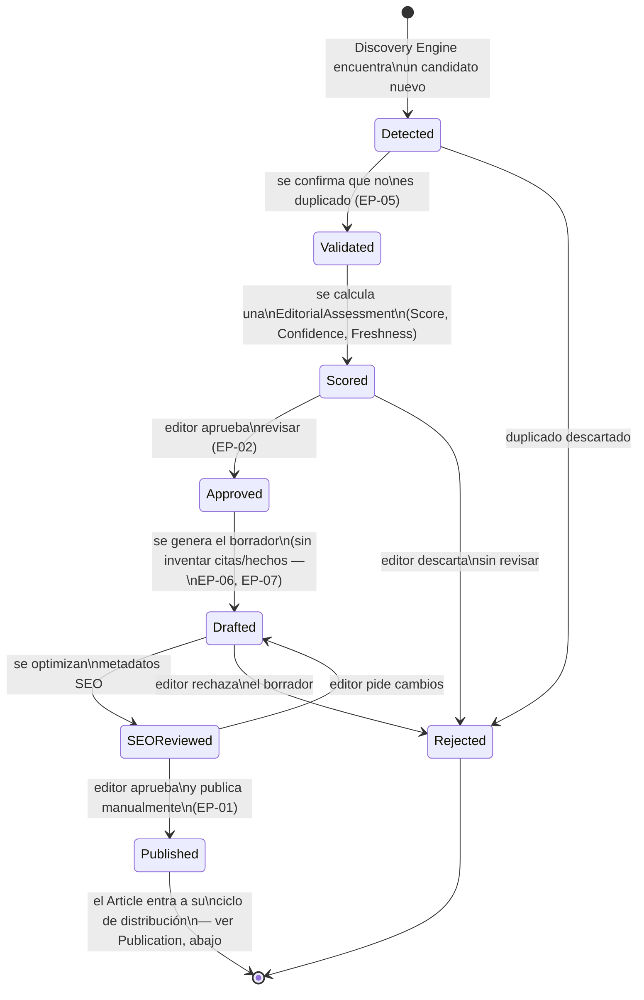
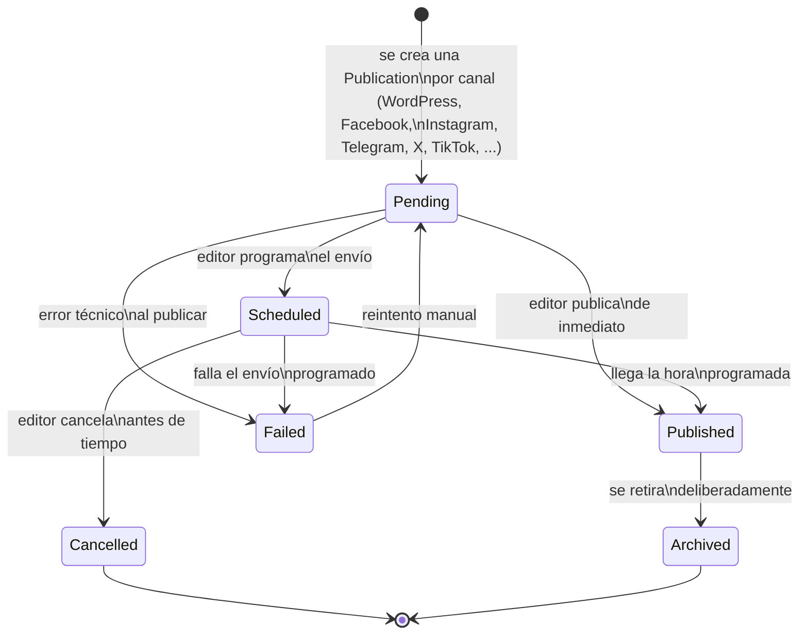

# Ciclo de vida de una noticia

> *Actualizado en Sprint 2.3.1* — ver
> [docs/adr/ADR-002-editorial-assessment.md](../adr/ADR-002-editorial-assessment.md).
> Este ciclo de vida ahora se divide en dos partes, alineadas con la
> separación entre `Article` y `Publication`: el **ciclo editorial** (de
> detectado a publicado, en el sentido de "listo y en su primer canal") y
> el **ciclo de distribución** (uno independiente por cada canal). La
> versión anterior de este documento trataba `Shared` y `Archived` como
> parte de un único ciclo y dejaba abierto si `ArticleStatus` debía
> extenderse para cubrirlos — ADR-002 responde esa pregunta: no,
> pertenecen a `PublicationStatus`.

## Ciclo editorial (`NewsCandidate` → `Article`)

Nótese que `Scored` ya no calcula "Score, Confidence y Freshness" como
tres números sueltos — calcula una `EditorialAssessment` (ver
[docs/product/DOMAIN_MODEL.md](../product/DOMAIN_MODEL.md)) que los
agrupa junto con `priority`, `reasoning` y `calculated_at`. Este estado
puede repetirse: un mismo candidato puede volver a pasar por `Scored`
más de una vez (por ejemplo, si se confirma un rumor y su Confidence
cambia), generando una nueva `EditorialAssessment` cada vez — sin que eso
sea, en sí mismo, una transición de estado adicional en este diagrama.

## Ciclo de distribución (`Publication`, uno por canal)

Un `Article` en estado `Published` (ciclo editorial) puede tener varias
`Publication` simultáneas en estados distintos — por ejemplo, WordPress
en `Published` mientras Instagram sigue en `Pending`, esperando la
aprobación del Editor de Redes (ver
[EDITOR_PERSONAS.md](EDITOR_PERSONAS.md)). Esa independencia es
precisamente por qué `Publication` es una entidad separada — ver
ADR-002.

## Los estados del ciclo editorial, explicados

| Estado | Qué significa | Quién lo produce |
|---|---|---|
| `Detected` | Un `NewsCandidate` fue encontrado por una fuente | Discovery Engine |
| `Validated` | Se confirmó que no es duplicado de algo ya procesado | El sistema (mecánico) |
| `Scored` | Tiene una `EditorialAssessment` calculada (Score, Confidence, Freshness, priority, reasoning) | El sistema (mecánico) |
| `Approved` | Un editor decidió que vale la pena convertirlo en artículo | Editor humano |
| `Drafted` | Existe un borrador de `Article` generado | Futuro agente Writer |
| `SEOReviewed` | El borrador tiene metadatos SEO revisados | Futuro agente SEO + editor |
| `Published` | Un editor lo publicó manualmente en su primer canal | Editor humano |

Los estados del ciclo de distribución (`Pending`, `Scheduled`, `Failed`,
`Archived`, `Cancelled`) se explican en la sección anterior, junto a su
diagrama — pertenecen a `Publication`, no a este ciclo.

`Rejected` puede alcanzarse desde `Detected` (duplicado), `Scored`
(editor descarta sin revisar) o `Drafted` (editor rechaza el borrador) —
siempre con motivo registrado (EP-10), nunca en silencio.

## Relación con `ArticleStatus` y `PublicationStatus` (Sprint 2.3.1)

`core.entities.article.ArticleStatus` (Sprint 2) modela la vida del
`Article` en el ciclo **editorial** únicamente — a propósito, se
mantiene simple:

| Ciclo editorial | `ArticleStatus` hoy |
|---|---|
| `Detected`, `Validated`, `Scored` | No aplica — todavía no existe un `Article`, solo un `NewsCandidate` |
| `Approved` | No tiene equivalente directo — es la decisión que dispara la creación del `Article` |
| `Drafted` | `DRAFT` |
| `SEOReviewed` | Sin equivalente — se resuelve con `EditorialTask`, no con un nuevo valor de `ArticleStatus` |
| — | `PENDING_REVIEW` (existe en código, se solapa con `Drafted`/`SEOReviewed` a la espera de aprobación) |
| — | `APPROVED` (existe en código; aquí la aprobación del borrador lleva directo a `Published`, porque publicar en el primer canal es un solo paso manual) |
| `Published` | `PUBLISHED` — ver nota abajo |
| `Rejected` | `REJECTED` |

`Shared` y `Archived` — los dos estados que en la versión anterior de
este documento no tenían equivalente claro en `ArticleStatus` — **no le
pertenecen a `Article`**. Le pertenecen a `Publication`, vía
`PublicationStatus` (`Published` cubre "compartido"; `Archived` es un
valor propio de `PublicationStatus` también). Esta era la pregunta
abierta que dejó la versión anterior de este documento; queda resuelta
en [docs/adr/ADR-002-editorial-assessment.md](../adr/ADR-002-editorial-assessment.md).

**Nota sobre `ArticleStatus.PUBLISHED`:** en el MVP (un solo canal,
WordPress), este valor y una única `Publication` en estado `Published`
son, en la práctica, equivalentes — no hace falta ningún cambio de
código para el MVP. La distinción empieza a importar de verdad a partir
del sprint "Social", cuando un mismo `Article` puede tener canales en
estados distintos a la vez (ver el diagrama de distribución arriba).

## Ver también

- [EDITORIAL_DECISION_TREE.md](EDITORIAL_DECISION_TREE.md) — el mismo
  recorrido, a nivel de decisión (quién decide qué), no de estados.
- [docs/business/editorial-workflow.md](../business/editorial-workflow.md) —
  la versión de negocio de este mismo flujo.
