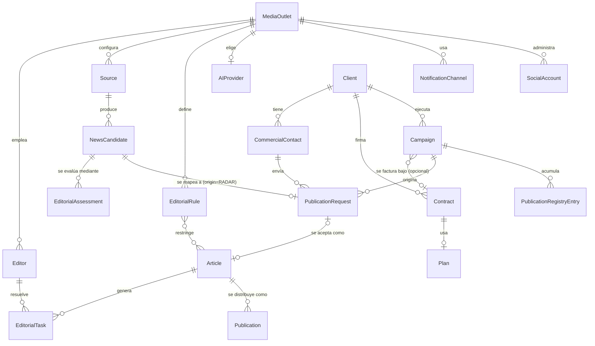

# Modelo de dominio (nivel de negocio)

> Este es el modelo de dominio **conceptual** de la plataforma — el
> vocabulario de negocio completo, pensado para múltiples clientes. No es
> lo mismo que `core/entities/`, el modelo de dominio **en código** hoy
> (que solo cubre lo que el MVP de Portal Vallenato necesita). La sección
> final de este documento marca explícitamente qué existe en código y qué
> es, por ahora, solo diseño — ver
> [docs/product/MVP_SCOPE.md](MVP_SCOPE.md) para el detalle completo de
> esa frontera.

## Entidades y su responsabilidad

### MediaOutlet

El cliente de la plataforma: un medio digital independiente. Es el
límite de propiedad de todo lo demás — cada `Source`, `Editor`,
`EditorialRule`, `AIProvider`, `NotificationChannel` y `SocialAccount`
pertenece exactamente a un `MediaOutlet`. Es la entidad ancla de la
futura multi-tenencia (ver
[docs/product/SAAS_EVOLUTION.md](SAAS_EVOLUTION.md)) — hoy existe
implícitamente (hay exactamente un `MediaOutlet`: Portal Vallenato), sin
necesidad de modelarlo en código todavía.

### Editor

Una persona del equipo editorial de un `MediaOutlet`, con un rol
(editor, encargado de redes, editor jefe). Es quien recibe y resuelve las
`EditorialTask`, y quien toma la decisión de aprobar, pedir cambios o
rechazar un `Article`.

### EditorialRule

Una regla editorial de un `MediaOutlet`, configurable: tono, longitud,
palabras prohibidas, atribución obligatoria de fuente, condiciones de
rechazo automático. Es la versión configurable-por-cliente de lo que hoy
[docs/editorial/style-guide.md](../editorial/style-guide.md) y
[docs/editorial/ai-writing-rules.md](../editorial/ai-writing-rules.md)
documentan como reglas fijas para Portal Vallenato.

### Source

Una fuente de contenido configurada (feed RSS, sitio, API) que el motor
de descubrimiento puede consultar. **Ya existe en código**
(`core.entities.source.Source`, Sprint 2). En el modelo conceptual,
pertenece a un `MediaOutlet`; en código hoy no necesita esa relación
porque solo hay un `MediaOutlet` implícito.

### NewsCandidate

Contenido detectado por una `Source`, antes de ser extraído por completo.
**Ya existe en código** (`core.entities.news_candidate.NewsCandidate`,
Sprint 2). Ver [docs/architecture/discovery-engine.md](../architecture/discovery-engine.md).

### EditorialAssessment (Value Object)

*Refinado en Sprint 2.3.1 — ver
[docs/adr/ADR-002-editorial-assessment.md](../adr/ADR-002-editorial-assessment.md)
para la decisión completa.*

La evaluación editorial de un `NewsCandidate`, calculada en un momento
dado: `score` ([Editorial Score](../editorial/EDITORIAL_SCORE.md)),
`confidence` ([Confidence](../editorial/CONFIDENCE_MODEL.md)),
`freshness` ([Freshness](../editorial/FRESHNESS_MODEL.md)), `priority`
(la prioridad combinada resultante, la que realmente ordena la bandeja
de un editor), `reasoning` (explicación legible de por qué se llegó a
estos valores) y `calculated_at` (cuándo se calculó).

Es un **Value Object**, no una entidad: no tiene identidad propia ni se
actualiza — cada vez que se recalcula (por ejemplo, cuando un rumor se
confirma y su Confidence cambia), se produce una `EditorialAssessment`
**nueva**, no se modifica la anterior. Un mismo `NewsCandidate` puede
tener varias `EditorialAssessment` a lo largo de su vida, formando un
historial de cómo cambió el juicio de la plataforma sobre él. Esto no es
un patrón nuevo en el proyecto: es la misma filosofía que ya usan las
entidades en código (`core/entities/*.py`, Sprint 2, todas
`frozen=True`) aplicada a un concepto que además necesita poder repetirse
en el tiempo.

Se separa deliberadamente de `NewsCandidate` y de `Article` — ver
[docs/editorial/EDITORIAL_SCORE.md](../editorial/EDITORIAL_SCORE.md) y el
ADR-002 para el razonamiento completo.

### Article

Un artículo en el pipeline editorial, desde que se extrae hasta que se
aprueba o se rechaza. **Ya existe en código**
(`core.entities.article.Article`, Sprint 2), con su ciclo de estados
(`ArticleStatus`).

`ArticleStatus` se mantiene deliberadamente simple (`DRAFT`,
`PENDING_REVIEW`, `APPROVED`, `REJECTED`, `PUBLISHED`) — describe
únicamente el estado **editorial** del contenido, nunca su estado de
**distribución** por canal. Esa complejidad vive en `Publication` y
`PublicationStatus`, no aquí — ver ADR-002.

### Publication

El registro de que un `Article` fue distribuido — o se intentó
distribuir — en un canal concreto: WordPress, Facebook, Instagram,
Telegram (como canal público, distinto del `NotificationChannel` interno
que usa el equipo editorial), X, TikTok, o cualquier canal futuro. Un
mismo `Article` puede generar **muchas** `Publication`, una por canal, y
cada una avanza con su propio `PublicationStatus`, independiente de las
demás y de `ArticleStatus`.

No existe en código todavía. En el MVP (un solo canal: WordPress),
`ArticleStatus.PUBLISHED` y una única `Publication` en estado
`Published` son, en la práctica, equivalentes — la separación se vuelve
indispensable a partir del sprint "Social" (v1.0), cuando aparece un
segundo canal de distribución.

#### PublicationStatus

| Estado | Qué significa |
|---|---|
| `Pending` | La `Publication` existe (por ejemplo, un borrador listo para ese canal) pero todavía no se envió |
| `Scheduled` | Un editor la programó para un momento futuro |
| `Published` | Está publicada y visible en ese canal |
| `Failed` | Se intentó publicar y falló (error técnico del canal) — requiere reintento manual |
| `Archived` | Se retiró deliberadamente de ese canal después de haber estado publicada |
| `Cancelled` | Un editor decidió no distribuir en ese canal, después de todo |

Ver el diagrama de estados completo en
[docs/editorial/NEWS_LIFECYCLE.md](../editorial/NEWS_LIFECYCLE.md).

### SocialAccount

Una cuenta de red social configurada de un `MediaOutlet` (Facebook,
Instagram, X) para la que el futuro agente Social propone contenido.
Nunca publica sola — misma regla no negociable que WordPress (ver
[docs/PROJECT_RULES.md](../PROJECT_RULES.md), regla 1).

### AIProvider

La configuración de qué proveedor de IA usa un `MediaOutlet` (OpenAI,
Anthropic, u otro), con sus credenciales y límites. Es la contraparte de
negocio del contrato técnico `core.ports.ai_provider.AIProvider` (un
`Protocol`) — la entidad de dominio describe **la elección del cliente**;
el port describe **el contrato técnico** que cualquier elección debe
cumplir.

### NotificationChannel

El canal por el que un `MediaOutlet` recibe notificaciones editoriales.
Telegram es el único canal hoy — esta entidad generaliza esa idea para
que Slack, email o WhatsApp puedan sumarse sin rediseñar nada. Contraparte
de negocio de `core.ports.notifier.Notifier`.

### EditorialTask

Una unidad de trabajo asignada a un `Editor` sobre un `Article` concreto
(revisar, aprobar, corregir). **Ya existe en código**
(`core.entities.editorial_task.EditorialTask`, Sprint 2).

### PublicationRequest

*Diseñada en Sprint 3A — ver
[docs/adr/ADR-003-publication-inbox.md](../adr/ADR-003-publication-inbox.md).
Implementada en Sprint 3B con una forma más simple que la diseñada allí;
ampliada en Sprint 4A. Ver
[ADR-006](../adr/ADR-006-multichannel-publication.md) para la
reconciliación completa.*

La solicitud comercial recibida de un `Client` (hoy siempre por WhatsApp,
copiada a mano por un operador — no existe todavía un canal automatizado).
Es la unidad de contenido reutilizable del pilar comercial: nace vinculada
opcionalmente a una `Pauta`, y desde Sprint 4A se distribuye a uno o
varios `DestinoPublicacion` (ver esa entidad debajo) en vez de representar
una sola publicación en un canal implícito.

**Forma real en código** (Sprint 3B.1 + Sprint 4A — no la diseñada en
ADR-003): `id`, `pauta_id` (opcional mientras `estado` es
`RECIBIDA`/`CANCELADA`, obligatorio en `ACEPTADA`), `fecha_recepcion`,
`titulo` (Incremento 2, opcional — expuesto en el formulario de creación
y edición), `texto`, `estado` (`PublicationRequestStatus`: `RECIBIDA`,
`ACEPTADA`, `CANCELADA` — `PUBLICADA` retirado en el Incremento 4, ver
abajo), `prioridad_manual`, `observaciones`, `fecha_cierre` (timestamp de
auditoría asignado una sola vez cuando la solicitud queda completa,
mismo patrón que `Pauta.fecha_registro`; escrito por
`cerrar_si_completa`, llamado desde el Incremento 4 en adelante).

**El cutover (Incremento 4) ya se hizo.** `PublicationRequestStatus`
quedó reducido a triage puro (`RECIBIDA`/`ACEPTADA`/`CANCELADA`) — la
complejidad de "qué tan publicada está" vive enteramente en
`DestinoPublicacion` vía `esta_completa`, el mismo rol que
`ArticleStatus`/`PublicationStatus` ya cumplen para `Article` (ADR-002).
`core.services.publication_request_service.aceptar` reemplaza al
retirado `mark_as_published`; el botón "Publicar" (`POST
/publication-requests/{id}/publish`) mantiene su comportamiento visible
sin cambios — acepta la solicitud y crea/reutiliza un destino WordPress
marcado `PUBLICADO`, así los números de cuota no cambian para el uso
diario existente. `PautaService.publicaciones_consumidas` cuenta por
`esta_completa`, no por `estado`. Una migración de datos
(`a1b2c3d4e5f6`) reescribió cada fila `estado='publicada'` existente a
`aceptada` + un `DestinoPublicacion` de compatibilidad — ver
[ADR-006](../adr/ADR-006-multichannel-publication.md), Decisiones 2–3, y
`CHANGELOG.md`, sección `[Unreleased]`.

**Nota de divergencia con ADR-003:** el diseño original incluía `origin`,
`is_commercial`, `client_id`/`campaign_id`/`commercial_contact_id`
directos, `priority`, `requested_publish_at` y un estado de cinco valores
(`RECEIVED`/`IN_REVIEW`/`ACCEPTED`/`REJECTED`/`DUPLICATE`). Ninguno de
esos campos se construyó así — Sprint 3B implementó la forma simple de
arriba (`CHANGELOG.md`, sección `[Unreleased]`, nota "Domain Adjustment").
Esta sección queda corregida para Sprint 4A únicamente en lo que toca a
`PublicationRequest`/`MediaAsset`; `CommercialContact`, `Contract`,
`Plan`, `Campaign` y `Alert` siguen sin construirse y su reconciliación
documental sigue pendiente, tal como ya señalaba el CHANGELOG. En
particular, `Pauta` (mencionada arriba y en `DestinoPublicacion` debajo)
es la entidad que Sprint 3B construyó realmente en lugar de
`Contract`/`Plan`/`Campaign` — `core/entities/pauta.py`, sin sección
propia todavía en este documento; añadirle una queda dentro de esa misma
reconciliación pendiente, no de este ADR.

### DestinoPublicacion

*Diseñada en Sprint 4A — ver
[ADR-006](../adr/ADR-006-multichannel-publication.md).*

El registro de que un `PublicationRequest` fue distribuido — o se intentó
distribuir — en un canal concreto: WordPress, Facebook o Instagram hoy;
TikTok, YouTube, X o Threads a futuro sin cambiar esta forma. Un mismo
`PublicationRequest` genera **varios** `DestinoPublicacion`, uno por canal
elegido, cada uno con su propio estado — el mismo rol que
`Publication`/`PublicationStatus` cumplen para `Article` (ver arriba y
ADR-002), aplicado ahora al pilar comercial en vez del editorial. No se
fusiona con la `Publication` conceptual de `Article`: ADR-003 ya
estableció que orgánico y comercial nunca convergen en una entidad
compartida.

| Atributo | Responsabilidad |
|---|---|
| `canal` | `CanalPublicacion`: `WORDPRESS`, `FACEBOOK`, `INSTAGRAM` |
| `estado` | `PENDIENTE`, `PUBLICADO`, `FALLIDO`, `CANCELADO` |
| `wp_post_id` / `wp_url` | Solo si `canal=WORDPRESS`, llenados automáticamente por `CMSPublisher.create_draft` |
| `url_publicacion` | Solo si `canal` es Facebook/Instagram — el enlace pegado a mano |
| `registrado_por_user_id` | Quién confirmó la publicación o registró el enlace |
| `fecha_publicacion` | Cuándo quedó realmente publicado ese destino |
| `ultimo_error` | Motivo si `FALLIDO` — cancelable a mano para no bloquear el cierre de la solicitud |

Un `PublicationRequest` está **completo** (`esta_completa`, condición
derivada, nunca un campo almacenado — misma disciplina que
`PautaService.publicaciones_consumidas`) cuando todos sus
`DestinoPublicacion` están en estado terminal (`PUBLICADO` o
`CANCELADO`) y al menos uno terminó `PUBLICADO`. Ese es el momento en
que se consume, una sola vez, la cuota de la `Pauta` vinculada, y en que
se asigna `PublicationRequest.fecha_cierre` — conectado end-to-end desde
el Incremento 4: `POST .../destinos/{id}/confirmar-publicacion` (registra
la publicación de un destino — `url_publicacion` obligatoria para
Facebook/Instagram) y `POST .../destinos/{id}/cancelar` recalculan
`esta_completa` sobre el conjunto completo de destinos de la solicitud
cada vez.

### MediaAsset

**Corrección respecto al diseño original (Sprint 3A):** se documentaba
como Value Object (`type`, `url_or_path`, `mime_type`, `caption`), sin
identidad propia. Diseñar el almacenamiento y la purga reales
([ADR-007](../adr/ADR-007-media-assets.md)) reveló que sí necesita
identidad — mismo argumento que ya resolvió `DestinoPublicacion` en
ADR-006: un value object no sostiene un ciclo de vida con acciones
externas (guardar el archivo real, borrarlo). Es una entidad hija por
`(solicitud, archivo)`, con su propia tabla y repositorio.

Un adjunto de un `PublicationRequest` — imagen o video (audio
deliberadamente fuera de alcance). Un `PublicationRequest` tiene 0..N
`MediaAsset`.

| Atributo | Responsabilidad |
|---|---|
| `id` | Identidad propia — necesaria para borrado individual |
| `publication_request_id` | El padre |
| `tipo` | `MediaAssetType`: `IMAGEN`, `VIDEO` |
| `nombre_archivo` | Nombre original tal como se subió — solo para mostrar, nunca para construir la ruta de almacenamiento |
| `content_type` | MIME real detectado en la subida |
| `tamano_bytes` | Para listar/mostrar y para que la purga reporte espacio liberado |
| `storage_key` | Clave opaca para el puerto `MediaStorage` — el dominio nunca arma rutas de disco a mano |
| `fecha_subida` | Cuándo se adjuntó |
| `subido_por_user_id` | Quién lo adjuntó |

Sin estados propios — a diferencia de `DestinoPublicacion`, no hay flujo
de confirmación; existe desde que se sube hasta que se purga o se borra
a mano. Se purga automáticamente `MEDIA_RETENTION_DIAS` (7 por defecto)
días después de que su `PublicationRequest` queda completa
(`fecha_cierre` no es `None`) — mientras la solicitud sigue abierta,
nunca se purga sin importar cuánto tiempo lleve pendiente. Almacenamiento
real: adaptador sobre un Railway Volume (`LocalDiskMediaStorage`) detrás
del puerto `MediaStorage`, elegido para no requerir una cuenta/
credenciales de almacenamiento externas en este incremento — swapear a
S3/R2 más adelante es un adaptador nuevo, no un cambio de dominio ni de
API. Ver [ADR-007](../adr/ADR-007-media-assets.md) para el detalle
completo (proveedor, límites de tamaño, superficie HTTP, script de
purga).

### Client

*Diseñada en Sprint 3A — ver
[docs/adr/ADR-004-commercial-manager.md](../adr/ADR-004-commercial-manager.md).*

El cliente comercial de Commercial Manager: un manager, artista o empresa
que paga (o tiene un acuerdo) por espacio editorial/promocional.

> **No confundir con `MediaOutlet`.** `MediaOutlet` es el *tenant* de la
> plataforma (hoy hay exactamente uno: Portal Vallenato). `Client` es un
> cliente comercial *de* ese `MediaOutlet` — vive enteramente dentro de él,
> no es un paso hacia multi-tenencia. Ver
> [ADR-004](../adr/ADR-004-commercial-manager.md), Decisión 1.

### CommercialContact

*Diseñada en Sprint 3A.* La persona que físicamente envía contenido por
WhatsApp (un manager, un asistente de prensa) — separada de `Client`
porque no siempre coinciden, y porque un contacto puede escribir antes de
que alguien lo vincule a un `Client` conocido. Ver
[ADR-004](../adr/ADR-004-commercial-manager.md), Decisión 2.

### Contract

*Diseñada en Sprint 3A.* El acuerdo comercial de un `Client`: a qué `Plan`
está suscrito, vigencia, estado. Responde "¿qué se acordó?" — distinto de
`Campaign`, que responde "¿qué se está ejecutando?". Ver
[ADR-004](../adr/ADR-004-commercial-manager.md), Decisión 3.

### Plan

*Diseñada en Sprint 3A.* La oferta comercial que un `Contract` referencia:
cuota mensual incluida, precio, canales incluidos.

### Campaign

*Diseñada en Sprint 3A.* La unidad operativa central de Commercial
Manager — el trabajo real que se ejecuta para un `Client` (ej.
"lanzamiento de disco X"), con o sin `Contract` asociado. Una campaña sin
contrato es un estado de negocio válido (cortesía, prueba); simplemente no
tiene cuota que vigilar. `PublicationRequest` y `PublicationRegistryEntry`
se atan primariamente a `Campaign`, no a `Contract`. Ver
[ADR-004](../adr/ADR-004-commercial-manager.md), Decisión 3.

### PublicationRegistryEntry

*Diseñada en Sprint 3A.* El registro de que un `Article` de una `Campaign`
llegó a `ArticleStatus.PUBLISHED`. Es la fuente de verdad para calcular
cuota consumida — la cuota se **deriva** contando estos registros, nunca
se guarda como contador mutable. Ver
[ADR-004](../adr/ADR-004-commercial-manager.md), Decisión 4.

### Alert

*Diseñada en Sprint 3A.* Cuota superada, contrato por vencer, u otra
condición de Commercial Manager que requiere atención humana.

## Relaciones

`NewsCandidate ||--o{ EditorialAssessment` es intencionalmente "uno a
muchos": cada recálculo agrega una `EditorialAssessment` nueva, nunca
reemplaza la anterior (ver la sección de arriba). `Article ||--o{
Publication` refleja que un artículo puede distribuirse en varios canales
a la vez, cada uno con su propio ciclo de vida.

Desde Sprint 3A, `Article` ya no nace directamente de `NewsCandidate`:
nace de `PublicationRequest`, el punto de convergencia de cualquier canal
(WhatsApp, Radar, manual, Email futuro) — ver
[docs/adr/ADR-003-publication-inbox.md](../adr/ADR-003-publication-inbox.md).
Para contenido de Radar, `NewsCandidate` sigue existiendo como paso
intermedio interno de Discovery, mapeado 1 a 1 a un `PublicationRequest`.
El bloque `Client`/`Contract`/`Plan`/`Campaign` (Commercial Manager) se
conecta con `PublicationRequest` solo por referencias de ID, nunca por
import directo entre bounded contexts — ver
[docs/adr/ADR-004-commercial-manager.md](../adr/ADR-004-commercial-manager.md).

## Frontera entre lo conceptual y lo implementado

| Entidad | Estado en código | Dónde |
|---|---|---|
| `Source` | ✅ Implementada | `core/entities/source.py` |
| `NewsCandidate` | ✅ Implementada | `core/entities/news_candidate.py` |
| `Article` | ✅ Implementada | `core/entities/article.py` |
| `EditorialTask` | ✅ Implementada | `core/entities/editorial_task.py` |
| `MediaOutlet` | ⬜ Conceptual, no implementada | — |
| `Editor` | ⬜ Conceptual, no implementada | — |
| `EditorialRule` | ⬜ Conceptual, no implementada | — |
| `EditorialAssessment` (Value Object) | ⬜ Conceptual, no implementada — ver ADR-002 | — |
| `Publication` / `PublicationStatus` | ⬜ Conceptual, no implementada | — |
| `SocialAccount` | ⬜ Conceptual, no implementada | — |
| `AIProvider` (entidad de negocio) | ⬜ Conceptual — existe el `Protocol` técnico homónimo en `core/ports/ai_provider.py`, no la entidad de negocio | — |
| `NotificationChannel` (entidad de negocio) | ⬜ Conceptual — existe el `Protocol` técnico `core.ports.notifier.Notifier`, no la entidad de negocio | — |
| `PublicationRequest` | ✅ Implementada — forma real difiere del diseño de [ADR-003](../adr/ADR-003-publication-inbox.md); reconciliada y ampliada en Sprint 4A, ver [ADR-006](../adr/ADR-006-multichannel-publication.md) | `core/entities/publication_request.py` |
| `DestinoPublicacion` | ✅ Implementada (Sprint 4A) — conectada a la API y a `PautaService` desde el Incremento 4, ver [ADR-006](../adr/ADR-006-multichannel-publication.md) | `core/entities/destino_publicacion.py` |
| `MediaAsset` | ✅ Implementada (Sprint 4A, Incremento 7) — ver [ADR-007](../adr/ADR-007-media-assets.md) | `core/entities/media_asset.py` |
| `Client` / `CommercialContact` / `Contract` / `Plan` / `Campaign` | ⬜ Diseñadas (Sprint 3A) — ver [ADR-004](../adr/ADR-004-commercial-manager.md) — implementación planeada Sprint 3B | — |
| `PublicationRegistryEntry` / `Alert` | ⬜ Diseñadas (Sprint 3A) — implementación planeada Sprint 3G | — |

Esta tabla es, en la práctica, el mapa de qué habría que construir para
pasar de "un cliente implícito" a "clientes explícitos y configurables" —
ver [docs/product/SAAS_EVOLUTION.md](SAAS_EVOLUTION.md).
