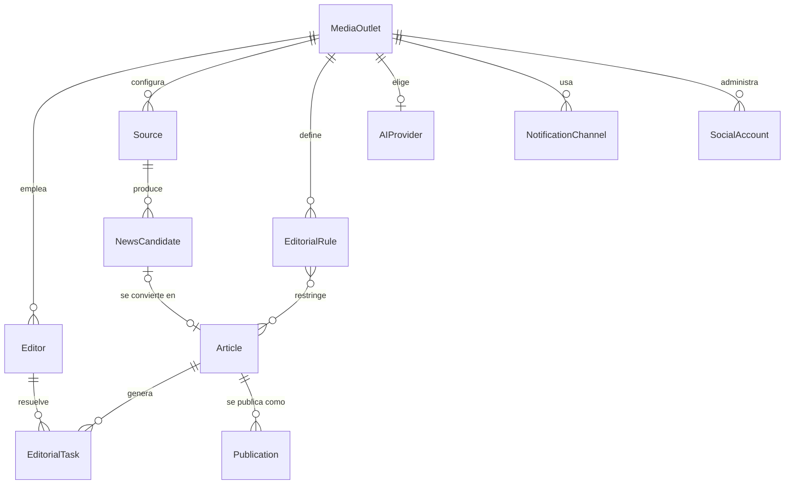

# Modelo de dominio (nivel de negocio)

> Este es el modelo de dominio **conceptual** de la plataforma — el
> vocabulario de negocio completo, pensado para múltiples clientes. No es
> lo mismo que `core/entities/`, el modelo de dominio **en código** hoy
> (que solo cubre lo que el MVP de Portal Vallenato necesita). La sección
> final de este documento marca explícitamente qué existe en código y qué
> es, por ahora, solo diseño — ver
> [docs/product/MVP_SCOPE.md](MVP_SCOPE.md) para el detalle completo de
> esa frontera.

## Entidades y su responsabilidad

### MediaOutlet

El cliente de la plataforma: un medio digital independiente. Es el
límite de propiedad de todo lo demás — cada `Source`, `Editor`,
`EditorialRule`, `AIProvider`, `NotificationChannel` y `SocialAccount`
pertenece exactamente a un `MediaOutlet`. Es la entidad ancla de la
futura multi-tenencia (ver
[docs/product/SAAS_EVOLUTION.md](SAAS_EVOLUTION.md)) — hoy existe
implícitamente (hay exactamente un `MediaOutlet`: Portal Vallenato), sin
necesidad de modelarlo en código todavía.

### Editor

Una persona del equipo editorial de un `MediaOutlet`, con un rol
(editor, encargado de redes, editor jefe). Es quien recibe y resuelve las
`EditorialTask`, y quien toma la decisión de aprobar, pedir cambios o
rechazar un `Article`.

### EditorialRule

Una regla editorial de un `MediaOutlet`, configurable: tono, longitud,
palabras prohibidas, atribución obligatoria de fuente, condiciones de
rechazo automático. Es la versión configurable-por-cliente de lo que hoy
[docs/editorial/style-guide.md](../editorial/style-guide.md) y
[docs/editorial/ai-writing-rules.md](../editorial/ai-writing-rules.md)
documentan como reglas fijas para Portal Vallenato.

### Source

Una fuente de contenido configurada (feed RSS, sitio, API) que el motor
de descubrimiento puede consultar. **Ya existe en código**
(`core.entities.source.Source`, Sprint 2). En el modelo conceptual,
pertenece a un `MediaOutlet`; en código hoy no necesita esa relación
porque solo hay un `MediaOutlet` implícito.

### NewsCandidate

Contenido detectado por una `Source`, antes de ser extraído por completo.
**Ya existe en código** (`core.entities.news_candidate.NewsCandidate`,
Sprint 2). Ver [docs/architecture/discovery-engine.md](../architecture/discovery-engine.md).

### Article

Un artículo en el pipeline editorial, desde que se extrae hasta que se
publica o se rechaza. **Ya existe en código**
(`core.entities.article.Article`, Sprint 2), con su ciclo de estados
(`ArticleStatus`).

### Publication

El registro de que un `Article` fue efectivamente publicado por un
humano en un canal concreto — cuándo, dónde, por quién. Distinto del
estado `PUBLISHED` de un `Article`: el estado dice "esto ya se publicó
en algún lado"; `Publication` es el hecho auditable de una publicación
específica, en un `MediaOutlet` que en el futuro podría publicar el mismo
artículo en más de un canal. No existe en código todavía — no hace falta
mientras un `Article` solo pueda terminar en un único sitio WordPress por
cliente.

### SocialAccount

Una cuenta de red social configurada de un `MediaOutlet` (Facebook,
Instagram, X) para la que el futuro agente Social propone contenido.
Nunca publica sola — misma regla no negociable que WordPress (ver
[docs/PROJECT_RULES.md](../PROJECT_RULES.md), regla 1).

### AIProvider

La configuración de qué proveedor de IA usa un `MediaOutlet` (OpenAI,
Anthropic, u otro), con sus credenciales y límites. Es la contraparte de
negocio del contrato técnico `core.ports.ai_provider.AIProvider` (un
`Protocol`) — la entidad de dominio describe **la elección del cliente**;
el port describe **el contrato técnico** que cualquier elección debe
cumplir.

### NotificationChannel

El canal por el que un `MediaOutlet` recibe notificaciones editoriales.
Telegram es el único canal hoy — esta entidad generaliza esa idea para
que Slack, email o WhatsApp puedan sumarse sin rediseñar nada. Contraparte
de negocio de `core.ports.notifier.Notifier`.

### EditorialTask

Una unidad de trabajo asignada a un `Editor` sobre un `Article` concreto
(revisar, aprobar, corregir). **Ya existe en código**
(`core.entities.editorial_task.EditorialTask`, Sprint 2).

## Relaciones

## Frontera entre lo conceptual y lo implementado

| Entidad | Estado en código | Dónde |
|---|---|---|
| `Source` | ✅ Implementada | `core/entities/source.py` |
| `NewsCandidate` | ✅ Implementada | `core/entities/news_candidate.py` |
| `Article` | ✅ Implementada | `core/entities/article.py` |
| `EditorialTask` | ✅ Implementada | `core/entities/editorial_task.py` |
| `MediaOutlet` | ⬜ Conceptual, no implementada | — |
| `Editor` | ⬜ Conceptual, no implementada | — |
| `EditorialRule` | ⬜ Conceptual, no implementada | — |
| `Publication` | ⬜ Conceptual, no implementada | — |
| `SocialAccount` | ⬜ Conceptual, no implementada | — |
| `AIProvider` (entidad de negocio) | ⬜ Conceptual — existe el `Protocol` técnico homónimo en `core/ports/ai_provider.py`, no la entidad de negocio | — |
| `NotificationChannel` (entidad de negocio) | ⬜ Conceptual — existe el `Protocol` técnico `core.ports.notifier.Notifier`, no la entidad de negocio | — |

Esta tabla es, en la práctica, el mapa de qué habría que construir para
pasar de "un cliente implícito" a "clientes explícitos y configurables" —
ver [docs/product/SAAS_EVOLUTION.md](SAAS_EVOLUTION.md).
