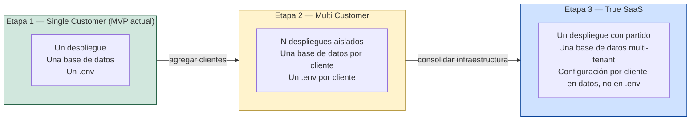

# Estrategia de evolución hacia SaaS

> Cómo se llega de "un cliente" a "una plataforma multi-cliente real"
> **sin reescribir el sistema**. Este documento no propone construir nada
> de esto ahora — describe por qué las decisiones ya tomadas (Sprint 1,
> ADR-001) dejan el camino abierto, y qué cambiaría, concretamente, en
> cada etapa.

## Las tres etapas

## Etapa 1 — Single Customer (dónde está el proyecto hoy)

Un despliegue, una base de datos, un `.env` — todo pertenece
implícitamente a Portal Vallenato. No existe la entidad `MediaOutlet` en
código. Ver [docs/product/MVP_SCOPE.md](MVP_SCOPE.md).

Esto es correcto para el momento actual: construir aislamiento
multi-cliente antes de tener un segundo cliente sería resolver un
problema hipotético, violando KISS (ver
[docs/ARCHITECTURE.md](../ARCHITECTURE.md), "Principios técnicos
aplicados").

## Etapa 2 — Multi Customer (varios clientes, sin SaaS todavía)

Un segundo medio se suma. La forma más simple y menos riesgosa de
servirlo **no es** construir multi-tenencia — es desplegar una segunda
instancia completa e independiente: su propia base de datos, su propio
`.env`, sus propias credenciales de WordPress y Telegram.

**Por qué esto casi no requiere cambios de código:** `config/settings.py`
ya lee toda su configuración de un `.env` (ver
[docs/PROJECT_RULES.md](../PROJECT_RULES.md), regla 2) — un segundo
cliente es, literalmente, un segundo `.env` y un segundo contenedor. Ni
`core/`, ni `agents/`, ni `database/` necesitan saber que existe más de
un cliente, porque desde la perspectiva de cada instancia desplegada,
sigue habiendo exactamente uno.

El costo de esta etapa está en operación, no en diseño: cada despliegue
nuevo es trabajo manual de infraestructura (ver
[docs/deployment/aws.md](../deployment/aws.md)), y N clientes son N
bases de datos, N sets de logs, N despliegues que actualizar en cada
release. Esa fricción operativa — no una limitación técnica del dominio —
es lo que justifica pasar a la Etapa 3 cuando el número de clientes lo
amerite.

## Etapa 3 — True SaaS (un despliegue, múltiples clientes)

Un único despliegue compartido sirve a todos los clientes. Esto sí
requiere cambios reales, ninguno implementado todavía:

1. **`MediaOutlet` se vuelve una entidad real**, persistida. Cada
   `Source`, `NewsCandidate`, `Article` y `EditorialTask` gana una
   relación con un `MediaOutlet` — un cambio **aditivo** (una
   columna/relación nueva), no un rediseño de esas entidades. Ver
   [docs/product/DOMAIN_MODEL.md](DOMAIN_MODEL.md).
2. **La configuración se mueve de `.env` a datos.** `config/settings.py`
   deja de ser la única fuente de configuración y pasa a proveer
   *defaults* y configuración de infraestructura (nivel proceso); la
   configuración específica de negocio por cliente (WordPress, Telegram,
   estilo editorial, proveedor de IA — ver
   [docs/product/CUSTOMER_CONFIGURATION.md](CUSTOMER_CONFIGURATION.md))
   pasa a vivir en una tabla, resuelta en tiempo de ejecución según qué
   `MediaOutlet` se esté procesando.
3. **Los agentes y `DiscoveryEngine` no cambian.** Siguen dependiendo de
   los mismos `Protocol` de `core/ports/` — la única diferencia es que
   quien los invoca (una capa de aplicación nueva, no el dominio) ahora
   construye esos adaptadores con las credenciales del `MediaOutlet`
   correcto en cada ejecución, en vez de con las de un único `.env`
   global. Esto es exactamente lo que Ports & Adapters está diseñado
   para permitir — ver
   [docs/adr/ADR-001-project-vision.md](../adr/ADR-001-project-vision.md),
   Decisión 4.
4. **Aparecen conceptos nuevos, antes explícitamente fuera de alcance:**
   autenticación (¿quién puede administrar qué `MediaOutlet`?),
   autorización, facturación, y probablemente una API (hasta ahora
   deliberadamente pospuesta — ver
   [docs/PROJECT_RULES.md](../PROJECT_RULES.md)) para que cada cliente
   pueda configurarse sin que un ingeniero edite un archivo.
5. **La infraestructura se consolida** (ver
   [docs/deployment/aws.md](../deployment/aws.md)): de N bases de datos y
   N despliegues a una base de datos multi-tenant y un despliegue
   compartido, con el aislamiento entre clientes garantizado a nivel de
   datos en lugar de a nivel de infraestructura.

## Por qué esto no obliga a reescribir el sistema

La razón concreta, no aspiracional: **`core/` nunca dependió de "Portal
Vallenato".** Ningún `Protocol` en `core/ports/`, ninguna entidad en
`core/entities/`, ningún servicio en `core/services/` menciona WordPress,
Telegram, ni ningún dato específico de un cliente — eso vive en
adaptadores y en `config/`. Multi-tenencia real es, estructuralmente, el
mismo tipo de cambio que "cambiar WordPress por otro CMS" (ver
[docs/adr/ADR-001-project-vision.md](../adr/ADR-001-project-vision.md)):
se resuelve en las capas externas (adaptadores, configuración,
composición en `app/`), no en el dominio.

Esto no fue diseñado explícitamente para SaaS en Sprint 1 — fue diseñado
para que un agente no dependa de un servicio externo concreto. Que esa
misma propiedad también habilite la evolución a SaaS es una consecuencia
de la disciplina arquitectónica, no una casualidad, y es la validación de
que esa disciplina valió la pena mantenerla incluso cuando solo había un
cliente.

## Qué NO propone este documento

- No propone construir `MediaOutlet`, autenticación, ni ninguna pieza de
  la Etapa 3 ahora. Ver [docs/product/MVP_SCOPE.md](MVP_SCOPE.md).
- No fija una fecha para pasar de una etapa a otra — eso depende de
  cuántos clientes reales exista, no de un calendario.
- No decide todavía el mecanismo exacto de aislamiento multi-tenant
  (esquema por cliente vs. columna discriminadora vs. base de datos por
  cliente con un router) — es una decisión de la Etapa 3, se formalizará
  en su propio ADR cuando corresponda.
