# Roadmap hacia v1.0

> Roadmap sprint a sprint. Para la narrativa por fases (visión más
> amplia, incluye lo que viene después de v1.0) ver
> [docs/ROADMAP.md](../ROADMAP.md) — ambos documentos se mantienen en
> sincronía a medida que se cierra cada sprint.

```mermaid
flowchart LR
    S1[Foundation] --> S2[Discovery]
    S2 --> S3[Persistence]
    S3 --> S4[RSS]
    S4 --> S5[Extractor]
    S5 --> S6[Writer]
    S6 --> S7[WordPress]
    S7 --> S8[Telegram]
    S8 --> S9[Social]
    S9 --> S10[Dashboard]
    S10 --> S11[Analytics]
    S11 --> V1([v1.0])

    style S1 fill:#d1e7dd,stroke:#0f5132
    style S2 fill:#d1e7dd,stroke:#0f5132
    style V1 fill:#cfe2ff,stroke:#084298
```

## ✅ Sprint: Foundation

Estructura modular, arquitectura hexagonal, configuración centralizada,
logging, scaffolding de base de datos, documentación base y contratos
(`core/ports`) para todos los agentes futuros. Sin lógica de negocio.
Incluye el sprint de hardening posterior (mypy/ruff/coverage reforzados,
`core/events`/`core/services` reservados).

## ✅ Sprint: Discovery

`DiscoveryEngine`: agrega, deduplica por hash y ordena candidatos de
varias fuentes. Entidades de dominio (`NewsCandidate`, `Source`,
`Article`, `EditorialTask`). `FakeContentSource` + fixtures para probar
sin red. Ver
[docs/architecture/discovery-engine.md](../architecture/discovery-engine.md).

## ⬜ Sprint: Persistence

Primeros modelos ORM (`database/models/`) y repositorios
(`database/repositories/`) implementando `core.ports.repository.Repository`.
Habilita la deduplicación **entre ejecuciones** (hoy `DiscoveryEngine`
solo deduplica dentro de una misma pasada) y el historial editorial
persistido que exige
[docs/PROJECT_RULES.md](../PROJECT_RULES.md), regla 11.

## ⬜ Sprint: RSS

Primer `core.ports.content_source.ContentSource` real: un adaptador que
lee feeds RSS. Primer paso concreto hacia el agente Radar — conecta
`DiscoveryEngine` con una fuente real por primera vez, sin cambiar el
motor.

## ⬜ Sprint: Extractor

`agents/extractor/`: extracción estructurada del contenido completo
(cuerpo, imágenes adicionales) a partir de un `NewsCandidate`, usando
Playwright/BeautifulSoup/Requests — primera vez que el proyecto habla con
sitios externos.

## ⬜ Sprint: Writer

`agents/writer/`: reescritura con estilo editorial vía
`core.ports.ai_provider.AIProvider`. Primeras plantillas reales en
`prompts/`, implementando
[docs/editorial/ai-writing-rules.md](../editorial/ai-writing-rules.md).

## ⬜ Sprint: WordPress

`agents/wordpress/`: creación de **borradores** (nunca publicaciones) vía
WordPress REST API — ver
[docs/PROJECT_RULES.md](../PROJECT_RULES.md), regla 1.

## ⬜ Sprint: Telegram

`agents/telegram/`: notificación al equipo editorial cuando un borrador
está listo, y registro de la decisión de aprobación/rechazo — cierra el
ciclo descrito en
[docs/business/editorial-workflow.md](../business/editorial-workflow.md).

## ⬜ Sprint: Social

`agents/social/`: propuestas de contenido para redes sociales a partir de
un artículo ya aprobado — nunca publicadas automáticamente.

## ⬜ Sprint: Dashboard

Primera interfaz visual para el equipo editorial (hoy todo es CLI/logs).
Es el punto donde el proyecto decidirá si introduce una capa de API
(hasta ahora deliberadamente fuera de alcance — ver
[docs/PROJECT_RULES.md](../PROJECT_RULES.md) y
[docs/ARCHITECTURE.md](../ARCHITECTURE.md)). Alcance técnico y stack a
definir en su propio ADR cuando se llegue a este sprint.

## ⬜ Sprint: Analytics

`agents/analytics/`: métricas editoriales (tiempo ahorrado, artículos
procesados, tasa de aprobación, fuentes más productivas) a partir del
historial persistido en el Sprint Persistence.

## ⬜ v1.0

Estabilización: revisión de extremo a extremo del flujo descrito en
[docs/business/editorial-workflow.md](../business/editorial-workflow.md),
cierre de brechas de cobertura de tests acumuladas (ver `CHANGELOG.md`),
documentación al día, y primer despliegue real siguiendo
[docs/deployment/aws.md](../deployment/aws.md).

## Cómo se actualiza este documento

Cada vez que un sprint se cierra, se marca ✅ aquí y se agrega la entrada
correspondiente en `CHANGELOG.md`. Este documento no se reordena ni se
reescribe retroactivamente — si el orden de los sprints cambia, se anota
el cambio, no se borra el plan anterior.
